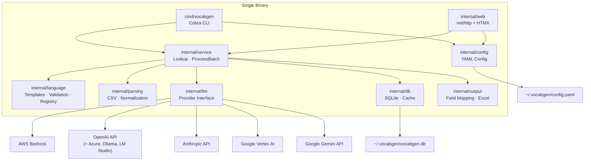
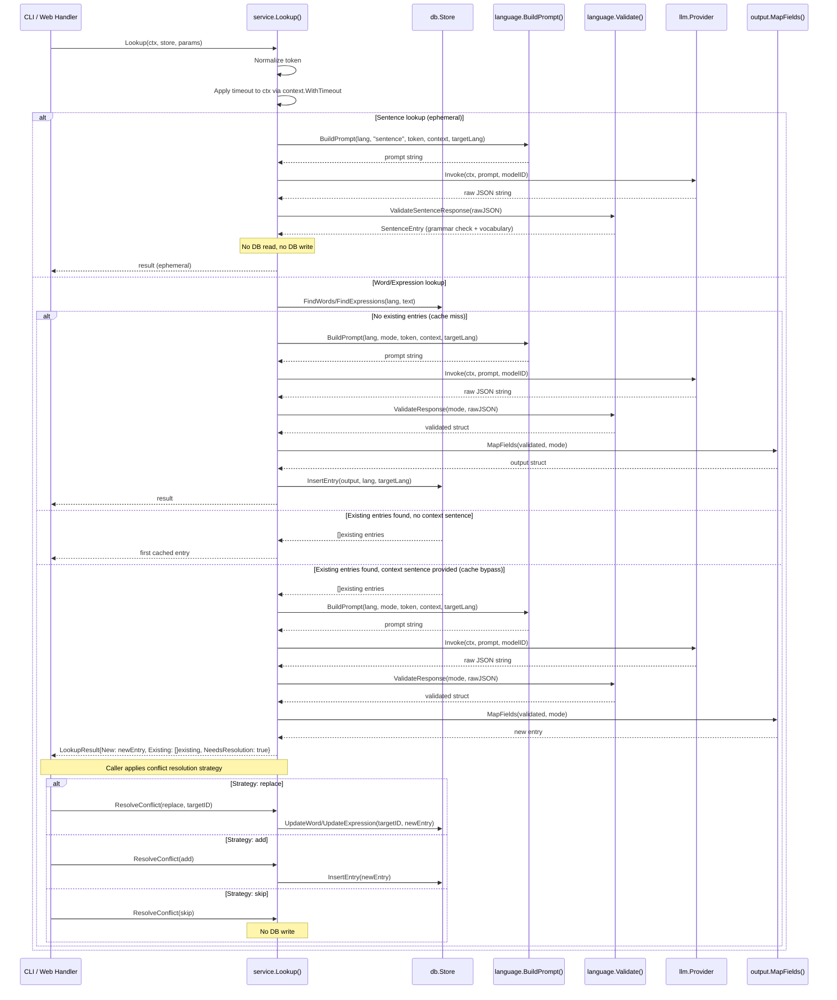
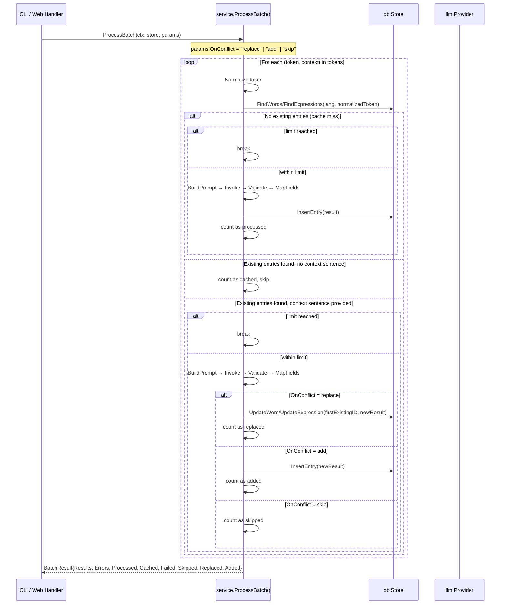
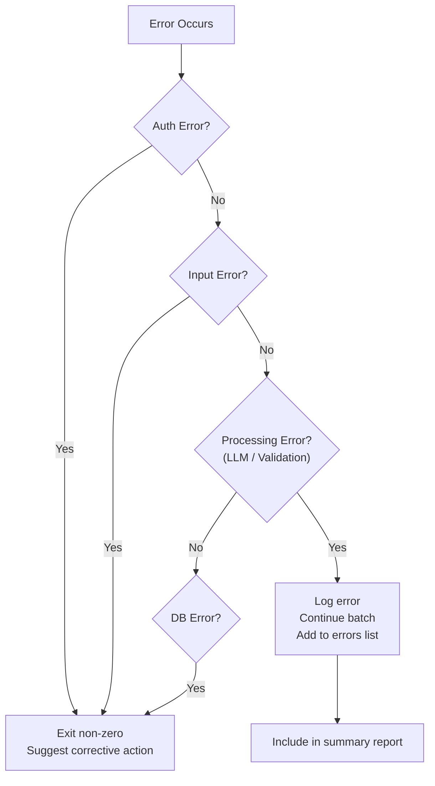

# Design Document: Go Vocabulary Generator

## Overview

The Go Vocabulary Generator (`vocabgen`) is a single-binary CLI and embedded web application that automates creation of structured B2→C1 vocabulary lists for language learners. It processes words, expressions, and sentences through LLM providers (Bedrock, OpenAI, Anthropic), validates and maps the JSON responses, caches word/expression results in SQLite (sentence lookups are ephemeral), and presents them via CLI output or a browser-based HTMX interface.

### Key Design Principles

1. **Single Binary**: All templates, static assets, and the SQLite driver compile into one executable via `go:embed` and a pure-Go SQLite driver. Zero runtime dependencies.
2. **Language-Agnostic**: Three unified prompt templates parameterized by `{source_language}` — words, expressions, and sentences. No per-language code branches. The LLM provides native POS labels, register labels, and grammatical categories.
3. **Provider Abstraction**: A Go `Provider` interface decouples the service layer from any specific LLM API. New providers require one file and one registry entry.
4. **Cache-First with Context Bypass**: SQLite acts as a cache layer — every lookup checks the DB before invoking the LLM, eliminating duplicate API costs. When a context sentence is provided for an existing entry, the cache is bypassed to get a context-specific result.
5. **Multi-Version Entries**: The database allows multiple entries per word/expression (e.g., "werk" as noun vs. verb). Conflict resolution (replace, add, skip) lets the user control how the vocabulary database evolves.
6. **Error Resilience**: Batch processing continues after per-item failures. Errors are collected and reported in a summary.
7. **Connotation-Aware**: A Core Rule Block and Decision Rubric in every prompt ensures translations preserve register and tone.

### Design Decisions

| Decision | Choice | Rationale |
|---|---|---|
| CLI framework | Cobra | Subcommands (`lookup`, `batch`, `serve`), auto-generated help, flag parsing |
| Web framework | stdlib `net/http` + `html/template` + HTMX | No JS build step, embedded in binary, sufficient for local tool |
| Database | SQLite via `modernc.org/sqlite` | Pure-Go, cross-compiles, embedded, zero-config |
| LLM abstraction | Go interface + provider registry | 5 real implementations (Bedrock, OpenAI, Anthropic, Vertex AI, Gemini), testable with manual mocks |
| Config format | YAML at `~/.vocabgen/config.yaml` | Human-readable, simple, `gopkg.in/yaml.v3` |
| PBT library | `pgregory.net/rapid` | Go-native, integrates with `testing`, no external runner |
| Excel export | `github.com/xuri/excelize/v2` | Well-maintained, pure-Go xlsx writer |
| Logging | `log/slog` | Stdlib, structured, leveled, zero dependencies |

## Architecture

### System Architecture



### Package Layout

```
vocabgen/
├── cmd/vocabgen/          # Cobra CLI entry point
│   └── main.go
├── internal/
│   ├── config/            # YAML config manager (LoadConfig, SaveConfig)
│   ├── db/                # SQLite schema, migrations, CRUD, cache layer
│   ├── language/          # Prompt templates, schemas, validation, language registry
│   ├── llm/               # Provider interface, Bedrock/OpenAI/Anthropic implementations
│   ├── output/            # Field mapping, translation flattening, Excel export
│   ├── parsing/           # CSV reading, word/expression normalization
│   ├── service/           # Lookup, ProcessBatch — shared business logic
│   └── web/               # HTTP handlers, routes, embedded templates
│       └── templates/     # Go html/template files (go:embed)
├── go.mod
├── go.sum
└── Makefile
```

### Data Flow: Single Lookup (with Context-Aware Cache Bypass and Conflict Resolution)



### Data Flow: Batch Processing (with Context-Aware Cache Bypass and Conflict Resolution)



## Components and Interfaces

### Go-Specific Patterns Used

This section explains Go idioms that appear throughout the design, for readers new to Go.

- **Interfaces**: Go interfaces are satisfied implicitly — a type implements an interface just by having the right methods, with no `implements` keyword. This is called "structural typing." The `Provider` interface below is satisfied by any struct with `Invoke` and `Name` methods matching the signatures.
- **"Accept interfaces, return structs"**: Constructor functions like `NewBedrockProvider(...)` return a concrete struct (e.g., `*BedrockProvider`), not the interface. Callers that need flexibility accept the `Provider` interface. This gives you both type safety and testability.
- **Constructor functions**: Go has no constructors. By convention, `NewXxx(...)` functions create and return initialized structs. They replace `__init__` or class constructors from other languages.
- **`context.Context` as first parameter**: Any function that does I/O (network calls, DB queries) takes `context.Context` as its first argument. This carries cancellation signals and deadlines through the call chain — critical for graceful shutdown and timeouts.
- **Error returns**: Go functions return errors as the last return value instead of throwing exceptions. Callers check `if err != nil` and handle or propagate. This makes error paths explicit.
- **`go:embed`**: A compiler directive that embeds files into the binary at compile time. Used for HTML templates and static assets so the binary is self-contained.
- **Embedding (struct composition)**: Go uses struct embedding instead of inheritance. A struct can embed another struct to "inherit" its methods. Not used heavily here, but worth knowing.

### 1. `internal/llm` — Provider Interface and Implementations

```go
// provider.go

// Provider defines the contract for LLM API backends.
// Any struct with these two methods automatically satisfies this interface.
type Provider interface {
    // Invoke sends a prompt to the LLM and returns the raw text response.
    // ctx carries cancellation/timeout; callers can cancel long-running requests.
    Invoke(ctx context.Context, prompt string, modelID string) (string, error)

    // Name returns the provider identifier (e.g., "bedrock", "openai").
    Name() string
}

// ProviderError wraps provider-specific errors with the provider name.
// All provider errors can be checked with errors.As(&ProviderError{}).
type ProviderError struct {
    Provider string
    Message  string
    Err      error // underlying error, if any
}

func (e *ProviderError) Error() string {
    return fmt.Sprintf("%s: %s", e.Provider, e.Message)
}

func (e *ProviderError) Unwrap() error { return e.Err }

// NewProviderFunc is the signature for provider constructor functions.
// The registry maps provider names to these constructors.
type NewProviderFunc func(opts ProviderOptions) (Provider, error)

// ProviderOptions holds configuration passed to provider constructors.
type ProviderOptions struct {
    APIKey     string // for OpenAI/Anthropic
    BaseURL    string // for OpenAI-compatible servers (Azure, Ollama, LM Studio)
    Region     string // for Bedrock (AWS) or Vertex AI (GCP)
    Profile    string // for Bedrock AWS profile
    GCPProject string // for Vertex AI
}

// Registry maps provider name strings to constructor functions.
var Registry = map[string]NewProviderFunc{
    "bedrock":   NewBedrockProvider,
    "openai":    NewOpenAIProvider,
    "anthropic": NewAnthropicProvider,
    "vertexai":  NewVertexAIProvider,
    "gemini":    NewGeminiProvider,
}
```

```go
// bedrock.go

// BedrockProvider implements Provider for AWS Bedrock.
type BedrockProvider struct {
    client    *bedrockruntime.Client // AWS SDK v2 Bedrock Runtime client
    region    string
    maxRetry  int
}

// NewBedrockProvider creates a BedrockProvider using the AWS credential chain.
// Returns a concrete *BedrockProvider (not the Provider interface) — this is
// the "accept interfaces, return structs" pattern.
func NewBedrockProvider(opts ProviderOptions) (Provider, error)

func (p *BedrockProvider) Invoke(ctx context.Context, prompt, modelID string) (string, error)
func (p *BedrockProvider) Name() string { return "bedrock" }
```

```go
// openai.go

type OpenAIProvider struct {
    apiKey   string
    baseURL  string
    maxRetry int
    client   *http.Client
}

func NewOpenAIProvider(opts ProviderOptions) (Provider, error)
func (p *OpenAIProvider) Invoke(ctx context.Context, prompt, modelID string) (string, error)
func (p *OpenAIProvider) Name() string { return "openai" }
```

```go
// anthropic.go

type AnthropicProvider struct {
    apiKey   string
    maxRetry int
    client   *http.Client
}

func NewAnthropicProvider(opts ProviderOptions) (Provider, error)
func (p *AnthropicProvider) Invoke(ctx context.Context, prompt, modelID string) (string, error)
func (p *AnthropicProvider) Name() string { return "anthropic" }
```

```go
// vertexai.go

type VertexAIProvider struct {
    project  string
    region   string
    maxRetry int
    client   *http.Client // uses Google ADC for auth
}

// NewVertexAIProvider creates a VertexAIProvider using Google Application Default Credentials.
func NewVertexAIProvider(opts ProviderOptions) (Provider, error)
func (p *VertexAIProvider) Invoke(ctx context.Context, prompt, modelID string) (string, error)
func (p *VertexAIProvider) Name() string { return "vertexai" }
```

```go
// gemini.go

// GeminiProvider implements Provider for the Google Gemini API (direct, via API key).
// Uses the generativelanguage.googleapis.com REST endpoint.
// Distinct from VertexAIProvider which uses GCP infrastructure and ADC.
type GeminiProvider struct {
    apiKey   string
    maxRetry int
    client   *http.Client
}

// NewGeminiProvider creates a GeminiProvider using a Gemini API key.
// Returns error if API key is empty.
func NewGeminiProvider(opts ProviderOptions) (Provider, error)
func (p *GeminiProvider) Invoke(ctx context.Context, prompt, modelID string) (string, error)
func (p *GeminiProvider) Name() string { return "gemini" }
```

### 2. `internal/language` — Templates, Validation, Registry

```go
// templates.go

// WordsTemplate is the unified prompt template for word lookups.
// Uses Go string formatting with named placeholders replaced via strings.NewReplacer.
const WordsTemplate = `You are helping to build a vocabulary list for {source_language} learners...`

// ExpressionsTemplate is the unified prompt template for expression lookups.
const ExpressionsTemplate = `You are helping to build a vocabulary list for {source_language} learners...`

// SentenceTemplate is the dedicated prompt template for sentence lookups.
// Focuses on grammar checking, correction, and key vocabulary extraction.
// Placeholders: {source_language}, {sentence}, {context}, {target_language_name}.
const SentenceTemplate = `You are a {source_language} language tutor...`

// BuildPrompt constructs a complete prompt from template + parameters.
// Returns an error only for invalid mode values.
func BuildPrompt(sourceLang, mode, token, context, targetLang string) (string, error)

// ResolveLanguageName maps a language code to its full name, or returns the input as-is.
func ResolveLanguageName(code string) string
```

```go
// registry.go

// SupportedLanguages maps language codes to full names.
// Used for both source and target language resolution.
var SupportedLanguages = map[string]string{
    "nl": "Dutch",
    "hu": "Hungarian",
    "it": "Italian",
    "ru": "Russian",
    "en": "English",
    "de": "German",
    "fr": "French",
    "es": "Spanish",
    "pt": "Portuguese",
    "pl": "Polish",
    "tr": "Turkish",
}

// GetHeaderMarker is removed — CSV input files have no headers.
// The --mode flag determines whether tokens are words or expressions.
```

```go
// validation.go

// ValidationError is returned when LLM JSON doesn't match the expected schema.
type ValidationError struct {
    Message string
    Fields  []string // names of problematic fields
}

func (e *ValidationError) Error() string { return e.Message }

// ValidateResponse parses raw JSON and validates against the English schema
// for the given mode ("words", "expressions", or "sentence").
// Normalizes translation fields and defaults optional fields to "".
func ValidateResponse(mode, rawJSON string) (*ValidatedEntry, error)

// ValidateSentenceResponse parses raw JSON and validates against the sentence schema.
// Returns a SentenceEntry with grammar check results and extracted vocabulary.
func ValidateSentenceResponse(rawJSON string) (*SentenceEntry, error)

// SentenceEntry holds the validated data from a sentence lookup LLM response.
type SentenceEntry struct {
    Sentence     string
    Translation  string
    GrammarCheck GrammarCheck
    Vocabulary   []VocabItem
}

// GrammarCheck holds grammar analysis results for a sentence.
type GrammarCheck struct {
    HasErrors         bool
    CorrectedSentence string
    Errors            []GrammarError
}

// GrammarError describes a single grammatical error found in the sentence.
type GrammarError struct {
    Original    string
    Corrected   string
    Explanation string
}

// VocabItem represents a key vocabulary item extracted from a sentence.
type VocabItem struct {
    Word       string
    Type       string // POS in source language terminology
    Definition string // in source language
    English    string // English translation
}
func ValidateResponse(mode, rawJSON string) (*ValidatedEntry, error)

// ValidatedEntry holds the validated and normalized data from an LLM response.
// Translation fields are always normalized to {primary, alternatives} form.
type ValidatedEntry struct {
    // Words fields (Expression field used for expressions mode)
    Word              string
    Expression        string
    Type              string
    Article           string
    Definition        string
    EnglishDefinition string
    Example           string
    English           Translation
    TargetTranslation Translation
    Notes             string
    Connotation       string
    Register          string
    Collocations      string       // words only
    ContrastiveNotes  string
    SecondaryMeanings string       // words only
}

// Translation holds a normalized translation with primary and alternatives.
type Translation struct {
    Primary      string
    Alternatives string
}
```

### 3. `internal/parsing` — CSV Reading and Normalization

```go
// csv.go

// ReadInputFile reads a CSV file and returns (token, context) pairs.
// Skips empty/whitespace-only lines. All non-empty lines are treated as data.
func ReadInputFile(path string) ([]TokenWithContext, error)

// TokenWithContext pairs a raw token with its optional context sentence.
type TokenWithContext struct {
    Token   string
    Context string
}
```

```go
// normalize.go

// NormalizeWord strips quotes, vocabulary-list markers (* > (sep.)),
// conjugation annotations (parenthetical groups with commas), collapses
// whitespace, and preserves simple parenthetical info (e.g., (ergens), (zich)).
// Returns empty string for whitespace-only input.
func NormalizeWord(raw string) string

// NormalizeExpression strips quotes, vocabulary-list markers, conjugation
// annotations, and collapses whitespace.
// Returns empty string for whitespace-only input.
func NormalizeExpression(raw string) string
```

### 4. `internal/service` — Business Logic

```go
// conflict.go

// ConflictStrategy represents the user's choice when a new LLM result
// conflicts with an existing database entry.
type ConflictStrategy string

const (
    // ConflictReplace updates the existing entry in-place.
    ConflictReplace ConflictStrategy = "replace"
    // ConflictAdd inserts the new result as a separate entry alongside existing ones.
    ConflictAdd ConflictStrategy = "add"
    // ConflictSkip discards the new result and keeps the existing entry unchanged.
    ConflictSkip ConflictStrategy = "skip"
)

// ParseConflictStrategy converts a string to a ConflictStrategy.
// Returns an error for invalid values.
func ParseConflictStrategy(s string) (ConflictStrategy, error)
```

```go
// service.go

// LookupParams holds all parameters for a single vocabulary lookup.
type LookupParams struct {
    SourceLang  string
    LookupType  string // "word", "expression", or "sentence"
    Text        string
    Provider    llm.Provider // accepts the interface, not a concrete type
    ModelID     string
    Context     string
    TargetLang  string
    Tags        string // comma-separated tags, or empty
    DryRun      bool
    Timeout     time.Duration // per-request LLM timeout (default 60s)
    OnConflict  ConflictStrategy // pre-selected strategy; empty means interactive
    ReplaceID   int64            // when OnConflict=replace and multiple entries exist, target this ID
}

// LookupResult holds the outcome of a single lookup, including conflict info.
type LookupResult struct {
    Entry           *output.Entry          // the new or cached entry (word/expression lookups)
    SentenceResult  *language.SentenceEntry // sentence analysis (sentence lookups only)
    Existing        []output.Entry         // existing entries (populated when conflict detected)
    ExistingIDs     []int64         // DB IDs of existing entries (for replace targeting)
    NeedsResolution bool            // true when context bypass found existing entries
    FromCache       bool            // true when result was served from cache
}

// Lookup performs a single vocabulary lookup: normalize → cache check →
// build prompt → invoke LLM → validate → map fields → handle conflict or store.
//
// For sentence lookups: always invokes LLM (no cache check, no DB write).
// Returns a LookupResult with Entry containing the sentence analysis as JSON.
// The service layer calls ValidateSentenceResponse instead of ValidateResponse.
//
// For word/expression lookups:
// When no context sentence is provided and entries exist: returns cached result.
// When a context sentence is provided and entries exist: invokes LLM (cache bypass),
// returns LookupResult with NeedsResolution=true so the caller can apply conflict resolution.
// When OnConflict is pre-set, applies the strategy automatically without requiring caller intervention.
func Lookup(ctx context.Context, store db.Store, params LookupParams) (*LookupResult, error)

// ResolveConflict applies a conflict resolution strategy after a cache-bypass lookup.
// For "replace": updates the entry at targetID with the new data.
// For "add": inserts the new entry as a separate row.
// For "skip": no-op.
func ResolveConflict(ctx context.Context, store db.Store, strategy ConflictStrategy, mode string, entry *output.Entry, targetID int64, sourceLang, targetLang, tags string) error

// BatchParams holds all parameters for batch processing.
type BatchParams struct {
    SourceLang string
    Mode       string // "words" or "expressions"
    Tokens     []parsing.TokenWithContext
    Provider   llm.Provider
    ModelID    string
    TargetLang string
    Tags       string // comma-separated tags, or empty
    Limit      int    // 0 means no limit
    DryRun     bool
    Timeout    time.Duration    // per-request LLM timeout (default 60s)
    OnConflict ConflictStrategy // batch-level conflict strategy (default: "skip")
    OnProgress func(current, total int, token, status string) // optional SSE progress callback
}

// BatchResult holds the outcome of batch processing.
type BatchResult struct {
    Results   []output.Entry
    Errors    []BatchError
    Processed int
    Cached    int
    Failed    int
    Skipped   int // empty tokens after normalization
    Replaced  int // entries updated via "replace" strategy
    Added     int // entries inserted via "add" strategy
}

// BatchError pairs a token with its error message.
type BatchError struct {
    Token   string
    Message string
}

// ProcessBatch processes a list of tokens: for each, normalize → cache check →
// (if context + existing: apply OnConflict strategy) → LLM invoke → validate → map → store.
// Continues on per-item errors. Checks ctx.Err() between items to support cancellation.
// If OnProgress is set, calls it after each item with current index, total, token, and status.
//
// Conflict resolution in batch mode:
// - Token with no context + existing entry → skip (cache hit, regardless of OnConflict)
// - Token with context + existing entry → invoke LLM, apply OnConflict strategy
// - Token with no existing entry → invoke LLM, insert normally
func ProcessBatch(ctx context.Context, store db.Store, params BatchParams) (*BatchResult, error)

// GetSupportedLanguages returns the language registry as a slice of {Code, Name} pairs.
func GetSupportedLanguages() []LanguageInfo
```

### 5. `internal/output` — Field Mapping and Export

```go
// mapper.go

// Entry is the final output struct with flattened translations.
// Used for CLI JSON output, web UI display, and DB storage.
type Entry struct {
    Word              string `json:"word,omitempty"`
    Expression        string `json:"expression,omitempty"`
    Type              string `json:"type,omitempty"`
    Article           string `json:"article,omitempty"`
    Definition        string `json:"definition"`
    EnglishDefinition string `json:"english_definition,omitempty"`
    Example           string `json:"example"`
    English           string `json:"english"`
    TargetTranslation string `json:"target_translation"`
    Notes             string `json:"notes"`
    Connotation       string `json:"connotation"`
    Register          string `json:"register"`
    Collocations      string `json:"collocations,omitempty"`
    ContrastiveNotes  string `json:"contrastive_notes"`
    SecondaryMeanings string `json:"secondary_meanings,omitempty"`
    Tags              string `json:"tags,omitempty"`
}

// MapFields converts a ValidatedEntry to an output Entry,
// flattening translation objects to "primary (alternatives)" strings.
// Mode determines which fields are populated (words vs expressions).
// Non-translation fields (including english_definition) are passed through as-is.
func MapFields(v *language.ValidatedEntry, mode string) *Entry

// FlattenTranslation converts a Translation to a display string.
// {primary: "p", alternatives: "a"} → "p (a)" when a is non-empty, else "p".
func FlattenTranslation(t language.Translation) string
```

```go
// excel.go

// ExportToExcel writes entries to an .xlsx file.
// Uses excelize for pure-Go Excel generation.
func ExportToExcel(entries []Entry, mode string) ([]byte, error)
```

### 6. `internal/db` — SQLite Storage and Cache

```go
// store.go

// Store defines the database operations interface.
// Using an interface here enables test doubles without a mocking framework.
type Store interface {
    // FindWord looks up a cached word entry by text and source language.
    // Returns the first matching entry or nil. Retained for backward compatibility.
    FindWord(ctx context.Context, word, sourceLang string) (*WordRow, error)

    // FindExpression looks up a cached expression entry.
    // Returns the first matching entry or nil. Retained for backward compatibility.
    FindExpression(ctx context.Context, expr, sourceLang string) (*ExpressionRow, error)

    // FindWords returns ALL matching word entries for a given word and source language.
    // Returns an empty slice (not nil) when no entries exist.
    // Used by the service layer for conflict-aware lookups (multi-version support).
    FindWords(ctx context.Context, word, sourceLang string) ([]WordRow, error)

    // FindExpressions returns ALL matching expression entries for a given expression and source language.
    // Returns an empty slice (not nil) when no entries exist.
    // Used by the service layer for conflict-aware lookups (multi-version support).
    FindExpressions(ctx context.Context, expr, sourceLang string) ([]ExpressionRow, error)

    // InsertWord stores a new word entry.
    InsertWord(ctx context.Context, row *WordRow) error

    // InsertExpression stores a new expression entry.
    InsertExpression(ctx context.Context, row *ExpressionRow) error

    // ListWords returns paginated word entries with optional filters.
    ListWords(ctx context.Context, filter ListFilter) ([]WordRow, int, error)

    // ListExpressions returns paginated expression entries with optional filters.
    ListExpressions(ctx context.Context, filter ListFilter) ([]ExpressionRow, int, error)

    // UpdateWord updates an existing word entry by ID.
    // Used by the "replace" conflict resolution strategy to update a specific version.
    UpdateWord(ctx context.Context, id int64, row *WordRow) error

    // UpdateExpression updates an existing expression entry by ID.
    // Used by the "replace" conflict resolution strategy to update a specific version.
    UpdateExpression(ctx context.Context, id int64, row *ExpressionRow) error

    // DeleteWord removes a word entry by ID.
    DeleteWord(ctx context.Context, id int64) error

    // DeleteExpression removes an expression entry by ID.
    DeleteExpression(ctx context.Context, id int64) error

    // BulkDeleteWords removes multiple word entries by IDs.
    BulkDeleteWords(ctx context.Context, ids []int64) error

    // BulkDeleteExpressions removes multiple expression entries by IDs.
    BulkDeleteExpressions(ctx context.Context, ids []int64) error

    // ImportWords bulk-inserts word rows, skipping duplicates.
    ImportWords(ctx context.Context, rows []WordRow) (imported, skipped, failed int, err error)

    // ImportExpressions bulk-inserts expression rows, skipping duplicates.
    ImportExpressions(ctx context.Context, rows []ExpressionRow) (imported, skipped, failed int, err error)

    // Close closes the database connection.
    Close() error

    // BackupTo copies the database file to the given path.
    BackupTo(ctx context.Context, destPath string) error

    // RestoreFrom replaces the current database with the file at srcPath.
    // Creates a backup of the current DB before overwriting.
    RestoreFrom(ctx context.Context, srcPath string) error
}

// ListFilter holds pagination and filter parameters for list queries.
type ListFilter struct {
    SourceLang string
    TargetLang string
    Search     string // matches against word/expression, definition, english
    Page       int    // 1-based
    PageSize   int    // default 50
}
```

```go
// sqlite.go

// SQLiteStore implements Store using modernc.org/sqlite.
type SQLiteStore struct {
    db *sql.DB
}

// NewSQLiteStore opens (or creates) the SQLite database at the given path,
// runs migrations, and returns a ready-to-use store.
func NewSQLiteStore(dbPath string) (*SQLiteStore, error)
```

```go
// schema.go

// Migrate runs schema migrations up to the current version.
// Each migration runs in a transaction — if it fails, the DB is unchanged.
func (s *SQLiteStore) Migrate() error

// Initial schema (version 1):
// - words table with index on (source_language, word)
// - expressions table with index on (source_language, expression)
// - metadata table with schema_version
```

```go
// models.go

// WordRow represents a row in the words table.
type WordRow struct {
    ID                int64
    Word              string
    PartOfSpeech      string
    Article           string
    Definition        string
    EnglishDefinition string
    Example           string
    English           string
    TargetTranslation string
    Notes             string
    Connotation       string
    Register          string
    Collocations      string
    ContrastiveNotes  string
    SecondaryMeanings string
    Tags              string // comma-separated tags
    SourceLanguage    string
    TargetLanguage    string
    CreatedAt         string // RFC3339 timestamp
    UpdatedAt         string
}

// ExpressionRow represents a row in the expressions table.
type ExpressionRow struct {
    ID                int64
    Expression        string
    Definition        string
    EnglishDefinition string
    Example           string
    English           string
    TargetTranslation string
    Notes             string
    Connotation       string
    Register          string
    ContrastiveNotes  string
    Tags              string // comma-separated tags
    SourceLanguage    string
    TargetLanguage    string
    CreatedAt         string
    UpdatedAt         string
}
```

### 7. `internal/config` — YAML Configuration

```go
// config.go

// Config holds application settings persisted to ~/.vocabgen/config.yaml.
// API keys are deliberately excluded — they come from env vars or CLI flags.
type Config struct {
    Provider              string `yaml:"provider"`
    AWSProfile            string `yaml:"aws_profile,omitempty"`
    AWSRegion             string `yaml:"aws_region"`
    ModelID               string `yaml:"model_id,omitempty"`
    BaseURL               string `yaml:"base_url,omitempty"`
    GCPProject            string `yaml:"gcp_project,omitempty"`
    GCPRegion             string `yaml:"gcp_region,omitempty"`
    DefaultSourceLanguage string `yaml:"default_source_language"`
    DefaultTargetLanguage string `yaml:"default_target_language"`
    DBPath                string `yaml:"db_path"`
}

// DefaultConfig returns the default configuration.
func DefaultConfig() Config {
    return Config{
        Provider:              "bedrock",
        AWSRegion:             "us-east-1",
        DefaultSourceLanguage: "nl",
        DefaultTargetLanguage: "hu",
        DBPath:                "~/.vocabgen/vocabgen.db",
    }
}

// LoadConfig reads config from ~/.vocabgen/config.yaml.
// Returns DefaultConfig() if the file doesn't exist.
func LoadConfig() (Config, error)

// SaveConfig writes config to ~/.vocabgen/config.yaml.
// Creates the directory if it doesn't exist.
// Never writes API keys to the file.
func SaveConfig(cfg Config) error
```

### 8. `internal/web` — HTTP Handlers, Embedded Templates, and Web UI

```go
// server.go

// Server holds the HTTP server and its dependencies.
type Server struct {
    store   db.Store
    cfg     *config.Config
    mux     *http.ServeMux
    logger  *slog.Logger
}

// NewServer creates a Server with all routes registered.
func NewServer(store db.Store, cfg *config.Config, logger *slog.Logger) *Server

// ListenAndServe starts the HTTP server. Blocks until ctx is cancelled,
// then performs graceful shutdown.
func (s *Server) ListenAndServe(ctx context.Context, addr string) error
```

```go
// templates.go

//go:embed templates/*.html templates/partials/*.html
var templateFS embed.FS

// Templates are parsed once at startup from the embedded filesystem.
```

```go
// routes.go — registered in NewServer

// Page routes (serve HTML)
// GET  /           → lookup page
// GET  /batch      → batch page
// GET  /config     → config page
// GET  /database   → database page

// API routes (JSON)
// POST   /api/lookup          → single lookup
// POST   /api/lookup/resolve  → resolve conflict after cache-bypass lookup
// POST   /api/batch           → batch processing (multipart)
// GET    /api/config          → read config
// PUT    /api/config          → update config
// GET    /api/languages       → list supported languages
// GET    /api/health          → health check
// POST   /api/test-connection → test provider connection
// GET    /api/words           → list/search words (paginated)
// GET    /api/expressions     → list/search expressions (paginated)
// PUT    /api/words/{id}      → update word entry
// PUT    /api/expressions/{id}→ update expression entry
// DELETE /api/words/{id}      → delete word entry
// DELETE /api/expressions/{id}→ delete expression entry
// DELETE /api/words/bulk      → bulk delete word entries (JSON array of IDs)
// DELETE /api/expressions/bulk→ bulk delete expression entries (JSON array of IDs)
// POST   /api/import          → CSV import (multipart)
// GET    /api/export          → Excel export

// HTMX partial routes (return HTML fragments)
// POST   /api/lookup/html     → lookup result partial (or conflict partial when cache bypass)
// POST   /api/lookup/resolve/html → resolve conflict, return final lookup result partial
// POST   /api/batch/html      → batch upload + start SSE stream
// GET    /api/batch/stream     → SSE endpoint for batch progress
// GET    /api/config/html     → config form partial
```

#### Web UI Architecture

The web UI uses server-side rendering with Go `html/template` and HTMX for dynamic interactions. All templates and static assets are embedded in the binary via `go:embed`. No JavaScript build step, no external file dependencies.

**Technology stack**: Go `html/template` + HTMX + Tailwind CSS (CDN)

**How HTMX works** (for Go newcomers): HTMX adds attributes to HTML elements that trigger HTTP requests and swap the response HTML into the page. For example, `hx-post="/api/lookup/html"` sends a POST when a form is submitted, and `hx-target="#result"` replaces the content of the `#result` div with the server's HTML response. No JavaScript needed — the server returns HTML fragments, not JSON.

#### Template File Structure

```
internal/web/templates/
├── base.html              # Shared layout: <html>, <head>, nav bar, Tailwind CDN, HTMX CDN
├── lookup.html            # Lookup page: form + result area
├── batch.html             # Batch page: upload form + summary area
├── config.html            # Config page: settings form + test connection
├── database.html          # Database page: table + filters + search + pagination
└── partials/
    ├── lookup_result.html # HTMX partial: rendered vocabulary entry
    ├── lookup_conflict.html # HTMX partial: side-by-side existing vs new entry with resolve buttons
    ├── batch_summary.html # HTMX partial: processed/cached/failed/replaced/added counts + error list
    ├── config_form.html   # HTMX partial: config form with current values
    ├── entry_edit.html    # HTMX partial: edit form for a single vocabulary entry
    └── entry_table.html   # HTMX partial: paginated table rows for database page
```

#### Template Inheritance Pattern

Go `html/template` uses `{{define}}` and `{{template}}` for composition (not inheritance like Jinja2). The base layout defines named blocks that page templates fill in:

```go
// base.html defines the shell
{{define "base"}}
<!DOCTYPE html>
<html lang="en">
<head>
    <meta charset="UTF-8">
    <script src="https://unpkg.com/htmx.org@2.0.4"></script>
    <script src="https://cdn.tailwindcss.com"></script>
    <title>VocabGen — {{template "title" .}}</title>
</head>
<body class="bg-gray-50">
    <nav><!-- Lookup | Batch | Config | Database --></nav>
    <main class="max-w-4xl mx-auto p-6">
        {{template "content" .}}
    </main>
</body>
</html>
{{end}}

// lookup.html fills in the blocks
{{define "title"}}Lookup{{end}}
{{define "content"}}
    <form hx-post="/api/lookup/html" hx-target="#result">
        <!-- text input, language selectors, type selector, submit -->
    </form>
    <div id="result"><!-- HTMX swaps lookup_result.html here --></div>
{{end}}
```

#### Page Designs

**Lookup Page** (`/`)
- Form: text input, source language dropdown, target language dropdown, lookup type radio (word/expression/sentence), optional context textarea, optional tags input
- Submit triggers `hx-post="/api/lookup/html"` → server returns `lookup_result.html` partial
- Loading: `hx-indicator="#lookup-spinner"` shows a spinner while the LLM request is in flight
- Result area shows: word/expression, POS, article, definition, english definition (when non-empty), example, English translation, target translation, notes, connotation, register, collocations, contrastive notes
- Error display: inline red alert if API returns error
- Conflict resolution (when context sentence triggers cache bypass and existing entries found):
  - The server returns a `lookup_conflict.html` partial instead of `lookup_result.html`
  - Side-by-side display: existing entry/entries on the left, new LLM result on the right
  - When multiple existing entries match, all are shown as a scrollable list on the left
  - Action buttons below the comparison: "Replace" (with entry selector dropdown when multiple exist), "Add as New Version", "Skip"
  - Each button triggers `hx-post="/api/lookup/resolve"` with the chosen strategy and target entry ID
  - After resolution, the server returns the final `lookup_result.html` partial showing the saved entry

**Batch Page** (`/batch`)
- Form: CSV file upload, source language dropdown, target language dropdown, mode radio (words/expressions), optional tags input, conflict resolution dropdown (skip/replace/add, default: skip)
- Submit triggers `hx-post="/api/batch/html"` with `hx-encoding="multipart/form-data"`
- Server enforces 10 MB upload limit (HTTP 413 on exceed)
- Progress: The batch endpoint uses Server-Sent Events (SSE) to stream real-time progress. The server sends events as each item completes:
  ```
  event: progress
  data: {"processed": 5, "cached": 2, "failed": 0, "total": 100, "current": "uitkomen"}

  event: complete
  data: {"processed": 85, "cached": 12, "failed": 3, "total": 100, "errors": [...]}
  ```
- The Web_UI uses HTMX SSE extension (`hx-ext="sse"`, `sse-connect="/api/batch/stream"`) to update a progress bar and current-token display in real-time
- On `complete` event, the progress area is replaced with the final `batch_summary.html` partial showing processed/cached/failed/replaced/added counts and failed items list
- Cancellation: A Cancel button is shown during processing. Clicking it aborts the fetch via `AbortController`. The server detects `ctx.Err()` between items and stops processing. A `cancelled` SSE event is emitted with partial results. The Web_UI displays partial results with a cancellation notice.
  ```
  event: cancelled
  data: {"processed": 30, "cached": 5, "failed": 1, "total": 100, "errors": [...]}
  ```

**Config Page** (`/config`)
- Form fields: provider dropdown (bedrock/openai/anthropic/vertexai), conditional fields shown/hidden via HTMX:
  - bedrock selected → show aws_profile, aws_region
  - openai selected → show env var hint for OPENAI_API_KEY, base_url
  - anthropic selected → show env var hint for ANTHROPIC_API_KEY
  - vertexai selected → show gcp_project, gcp_region
- Common fields: model_id, default_source_language, default_target_language
- Read-only: database path
- Save button → `hx-put="/api/config"` → inline success/error message
- Test Connection button → `hx-post="/api/test-connection"` → inline result (uses API keys from env vars)
- On save, validates that required env vars/credentials are available for the selected provider; shows error if missing

**Database Page** (`/database`)
- Filter bar: source language dropdown, target language dropdown, type radio (words/expressions), search text input (300ms debounce via `hx-trigger="keyup changed delay:300ms"`)
- Table: paginated (50 rows/page), columns vary by type (word vs expression fields)
- Multi-version indicator: entries sharing the same word/expression text are visually distinguished (e.g., POS badge or version count indicator) so the user can tell apart "werk (znw)" from "werk (ww)"
- Total count display above table
- Row click → `entry_edit.html` partial with pre-populated edit form
- Edit form: save → `hx-put="/api/words/{id}"` or `hx-put="/api/expressions/{id}"`
- Delete button with `hx-confirm="Are you sure?"` → `hx-delete="/api/words/{id}"`
- Bulk delete: each row has a checkbox; a "select all" checkbox toggles all visible entries. When entries are selected, a bulk action bar appears with a Delete Selected button. Clicking it sends `DELETE /api/words/bulk` (or `/api/expressions/bulk`) with a JSON array of IDs. The table refreshes after deletion.
- Import: CSV upload form (file, source_lang, target_lang, type) → `hx-post="/api/import"` → summary
- Export: button → `GET /api/export?source_lang=...&type=...` → downloads .xlsx file
- Export button disabled when no entries match current filters

#### HTMX Interaction Patterns

| User Action | HTMX Attribute | Server Endpoint | Response |
|---|---|---|---|
| Submit lookup form | `hx-post="/api/lookup/html"` | POST /api/lookup/html | `lookup_result.html` or `lookup_conflict.html` partial |
| Resolve lookup conflict | `hx-post="/api/lookup/resolve"` | POST /api/lookup/resolve | `lookup_result.html` partial |
| Upload batch CSV | `hx-post="/api/batch/html"` | POST /api/batch/html | Starts processing, returns SSE connection info |
| Batch progress | `sse-connect="/api/batch/stream"` | GET /api/batch/stream | SSE events: progress, complete |
| Save config | `hx-put="/api/config"` | PUT /api/config | `config_form.html` partial with success msg |
| Test connection | `hx-post="/api/test-connection"` | POST /api/test-connection | Inline result text |
| Search database | `hx-get="/api/words"` `hx-trigger="keyup changed delay:300ms"` | GET /api/words?search=... | `entry_table.html` partial |
| Change page | `hx-get="/api/words?page=2"` | GET /api/words?page=2 | `entry_table.html` partial |
| Click entry row | `hx-get="/api/words/{id}/edit"` | GET /api/words/{id}/edit | `entry_edit.html` partial |
| Save entry edit | `hx-put="/api/words/{id}"` | PUT /api/words/{id} | Updated row HTML |
| Delete entry | `hx-delete="/api/words/{id}"` `hx-confirm` | DELETE /api/words/{id} | Empty (row removed) |
| Bulk delete | `hx-delete="/api/words/bulk"` `hx-confirm` | DELETE /api/words/bulk | Updated `entry_table.html` partial |
| Import CSV | `hx-post="/api/import"` | POST /api/import | Import summary HTML |
| Change provider | `hx-get="/api/config/html?provider=openai"` | GET /api/config/html | `config_form.html` with conditional fields |

#### Navigation

Shared nav bar in `base.html` with four links: Lookup (`/`), Batch (`/batch`), Config (`/config`), Database (`/database`). Active page highlighted via template data.

### 9. `cmd/vocabgen` — CLI Entry Point

```go
// main.go

func main() {
    // rootCmd with persistent flags: --verbose, --provider, --region, --timeout, --tags, --version
    // Subcommands: lookupCmd, batchCmd, serveCmd, backupCmd, restoreCmd, versionCmd
    // Config loaded at PreRun; CLI flags override config values.
    // Version injected via ldflags at build time.
}

// lookupCmd: vocabgen lookup "uitkomen" -l nl --type word --context "De waarheid komt altijd uit." --tags "chapter-3"
// lookupCmd with conflict: vocabgen lookup "werk" -l nl --type word --context "Ik ga naar mijn werk." --on-conflict add
// batchCmd:  vocabgen batch --input-file ch1.csv --mode words -l nl --tags "chapter-1"
// batchCmd with conflict: vocabgen batch --input-file ch1.csv --mode words -l nl --on-conflict replace
// serveCmd:  vocabgen serve --port 8080
// backupCmd: vocabgen backup → copies vocabgen.db to vocabgen.db.2026-03-30T14-00-00.bak
// restoreCmd: vocabgen restore ~/.vocabgen/vocabgen.db.2026-03-30T14-00-00.bak
// versionCmd: vocabgen version → "vocabgen v1.0.0 (go1.22.0, built 2026-03-30)"
```

## Data Models

### Unified Words JSON Schema

The LLM returns JSON with these English field names. Required fields must be present; optional fields default to `""`.

| Field | Type | Required | Description |
|---|---|---|---|
| `word` | string | yes | Canonical form (infinitive/singular) |
| `type` | string | yes | Native POS label (e.g., "znw", "főnév") |
| `article` | string | yes | Article/gender marker, or "—" |
| `definition` | string | yes | Definition in source language |
| `english_definition` | string | no | Concise English-language explanation of meaning |
| `example` | string | yes | Example sentence in source language |
| `english` | string or object | yes | `{primary, alternatives}` or plain string |
| `target_translation` | string or object | yes | `{primary, alternatives}` or plain string |
| `notes` | string | no | Connotation notes, register, tone |
| `connotation` | string | no | Emotional/evaluative association |
| `register` | string | no | Native register label |
| `collocations` | string | no | 2–4 common collocations, semicolon-separated |
| `contrastive_notes` | string | no | Near-synonyms with difference explanation |
| `secondary_meanings` | string | no | Additional meanings, semicolon-separated |

### Unified Expressions JSON Schema

| Field | Type | Required | Description |
|---|---|---|---|
| `expression` | string | yes | The expression text |
| `definition` | string | yes | Definition in source language |
| `english_definition` | string | no | Concise English-language explanation of meaning |
| `example` | string | yes | Example sentence in source language |
| `english` | string or object | yes | `{primary, alternatives}` or plain string |
| `target_translation` | string or object | yes | `{primary, alternatives}` or plain string |
| `notes` | string | no | Connotation notes, register, tone |
| `connotation` | string | no | Emotional/evaluative association |
| `register` | string | no | Native register label |
| `contrastive_notes` | string | no | Near-synonyms with difference explanation |

### Translation Object

Nested form: `{"primary": "main translation", "alternatives": "alt1; alt2"}`
Plain string form: validator normalizes to `{"primary": "the string", "alternatives": ""}`

### SQLite Schema (Version 1)

Note: The words and expressions tables intentionally have no unique constraint on (source_language, word) or (source_language, expression). Multiple rows with the same word/expression and source_language are allowed to support multi-version entries (e.g., "werk" as noun vs. verb). The indexes on these columns are for query performance, not uniqueness.

```sql
CREATE TABLE IF NOT EXISTS metadata (
    key   TEXT PRIMARY KEY,
    value TEXT NOT NULL
);
-- Initial: INSERT INTO metadata (key, value) VALUES ('schema_version', '1');

CREATE TABLE IF NOT EXISTS words (
    id                  INTEGER PRIMARY KEY AUTOINCREMENT,
    word                TEXT NOT NULL,
    part_of_speech      TEXT,
    article             TEXT,
    definition          TEXT,
    english_definition  TEXT,
    example             TEXT,
    english             TEXT,
    target_translation  TEXT,
    notes               TEXT,
    connotation         TEXT,
    register            TEXT,
    collocations        TEXT,
    contrastive_notes   TEXT,
    secondary_meanings  TEXT,
    tags                TEXT,
    source_language     TEXT NOT NULL,
    target_language     TEXT NOT NULL,
    created_at          TEXT NOT NULL,
    updated_at          TEXT NOT NULL
);
CREATE INDEX IF NOT EXISTS idx_words_lang_word ON words(source_language, word);

CREATE TABLE IF NOT EXISTS expressions (
    id                  INTEGER PRIMARY KEY AUTOINCREMENT,
    expression          TEXT NOT NULL,
    definition          TEXT,
    english_definition  TEXT,
    example             TEXT,
    english             TEXT,
    target_translation  TEXT,
    notes               TEXT,
    connotation         TEXT,
    register            TEXT,
    contrastive_notes   TEXT,
    tags                TEXT,
    source_language     TEXT NOT NULL,
    target_language     TEXT NOT NULL,
    created_at          TEXT NOT NULL,
    updated_at          TEXT NOT NULL
);
CREATE INDEX IF NOT EXISTS idx_expr_lang_expr ON expressions(source_language, expression);
```

### Config YAML Schema

```yaml
provider: bedrock              # "bedrock", "openai", "anthropic", or "vertexai"
aws_profile: ""                # AWS profile name (bedrock only)
aws_region: us-east-1          # AWS region (bedrock only)
model_id: ""                   # LLM model identifier
base_url: ""                   # Custom API endpoint (openai only)
gcp_project: ""                # GCP project ID (vertexai only)
gcp_region: us-central1        # GCP region (vertexai only)
default_source_language: nl    # Default source language code
default_target_language: hu    # Default target language code
db_path: ~/.vocabgen/vocabgen.db
```

Note: `api_key` is deliberately absent — sourced from env vars (`OPENAI_API_KEY`, `ANTHROPIC_API_KEY`) or `--api-key` CLI flag at runtime.

### Supported Languages Registry

```go
var SupportedLanguages = map[string]string{
    "nl": "Dutch",    "hu": "Hungarian", "it": "Italian",
    "ru": "Russian",  "en": "English",   "de": "German",
    "fr": "French",   "es": "Spanish",   "pt": "Portuguese",
    "pl": "Polish",   "tr": "Turkish",
}
```

## Correctness Properties

*A property is a characteristic or behavior that should hold true across all valid executions of a system — essentially, a formal statement about what the system should do. Properties serve as the bridge between human-readable specifications and machine-verifiable correctness guarantees.*

### Property 1: Template formatting produces valid prompts for any source language

*For any* source language name string (including known codes like "nl" and arbitrary names like "German" or "日本語"), formatting either the words or expressions template with valid parameters (token, context, target_language_name) should produce a string that: contains the resolved source language name, contains the token value, contains the target language name, contains no unresolved `{...}` placeholders, contains the Core Rule Block text, and contains the Decision Rubric text.

**Validates: Requirements 1.10, 2.9, 4.5**

### Property 2: Translation field normalization

*For any* translation value that is either a plain string or a JSON object with `primary` (string) and optional `alternatives` (string) keys, the Validator should normalize it to an object with exactly two keys: `primary` (string) and `alternatives` (string, defaulting to `""` if absent). When the input is a plain string `s`, the output should be `{"primary": s, "alternatives": ""}`.

**Validates: Requirements 3.3, 3.4**

### Property 3: Optional fields default to empty string

*For any* valid JSON response where a random subset of optional fields (`notes`, `connotation`, `register`, `collocations`, `contrastive_notes`, `secondary_meanings`, `english_definition`) is absent, the Validator should succeed and the returned struct should contain those fields with value `""`.

**Validates: Requirements 3.5, 52.1, 52.4**

### Property 4: Missing required fields and malformed values return validation error

*For any* non-empty subset of required fields removed from an otherwise valid JSON response, the Validator should return an error and the error message should mention every missing field name. Additionally, non-string values for optional fields and malformed translation fields (neither string nor valid object with string `primary`) should also return a validation error.

**Validates: Requirements 3.6, 3.7, 3.8, 3.9**

### Property 5: BuildPrompt injects all parameters into output

*For any* source language (known code or arbitrary name), mode ("words" or "expressions"), token string, context string, and target language code, `BuildPrompt` should return a string containing the resolved source language name, the token, the context (when non-empty), and the resolved target language name.

**Validates: Requirements 6.1–6.6, 42.1–42.4**

### Property 6: CSV parsing

*For any* list of CSV lines (some empty, some containing data), the input parser should return exactly the non-empty lines as (token, context) pairs. Two-column lines return both token and context; single-column lines return token with empty context.

**Validates: Requirements 14.2, 14.5, 14.6**

### Property 7: Field mapper pass-through preserves non-translation fields

*For any* validated entry with English field names (as returned by the Validator), the Field_Mapper should return an output entry where every non-translation field value equals the corresponding input field value.

**Validates: Requirement 5.1**

### Property 8: Translation flattening

*For any* Translation struct `{Primary: p, Alternatives: a}` where `p` and `a` are strings, `FlattenTranslation` should return `"p (a)"` when `a` is non-empty, and `p` when `a` is empty. For a plain string input `s`, it should return `s`.

**Validates: Requirements 5.2, 5.5**

### Property 9: Validation accepts any valid English-schema JSON

*For any* JSON object containing all required English field names with string values (and translation fields as string or valid object), the Validator should succeed for the matching mode and return a struct with all schema fields present. A synthetically generated valid JSON response should pass through `ValidateResponse` then `MapFields` without returning any error.

**Validates: Requirements 3.1, 3.2, 43.10**

### Property 10: Token normalization consistency (idempotence)

*For any* input token (word or expression), normalizing the token should strip quotes, collapse whitespace, and strip leading/trailing whitespace, producing a consistent canonical form. Normalizing an already-normalized token should produce the same result (i.e., `Normalize(Normalize(x)) == Normalize(x)`).

**Validates: Requirements 15.1–15.4, 16.1–16.3**

### Property 11: Database cache idempotency

*For any* input token, looking it up twice through the service layer (with a mocked provider and real SQLite store) should result in exactly one LLM invocation and one cache hit. The returned data should be identical for both calls.

**Validates: Requirements 18.1–18.4, 19.1–19.4**

### Property 12: UTF-8 round-trip consistency

*For any* text containing special characters (ë, ï, ü, ő, ű, à, è, ì, ò, ù, я, ё, etc.), writing to the SQLite database then reading back should preserve the exact character sequence.

**Validates: Requirements 39.1, 39.2**

### Property 13: Dry-run no side effects

*For any* input token list, running `ProcessBatch` in dry-run mode should not invoke the LLM provider, not write to the database, and not modify any persistent state. The provider's `Invoke` method should be called zero times.

**Validates: Requirements 37.1–37.4**

### Property 14: Config file round-trip

*For any* valid Config struct (with non-sensitive fields only), saving via `SaveConfig` then loading via `LoadConfig` should produce a struct equal to the original.

**Validates: Requirements 34.1, 34.2**

### Property 15: Limit enforcement

*For any* limit value N and input with M tokens (M > N, no cached items), `ProcessBatch` should invoke the LLM provider for at most N tokens.

**Validates: Requirement 23.6**

### Property 16: Error resilience

*For any* list of tokens where a mocked provider fails on a known subset and succeeds on the rest, `ProcessBatch` should return results for all successful tokens and errors for all failed tokens. The count of results plus errors should equal the count of non-empty, non-cached input tokens (up to the limit).

**Validates: Requirement 36.3**

### Property 17: Provider interface consistency

*For any* provider implementation (including test doubles), `Invoke` should return either a non-empty string with nil error, or an empty string with a non-nil error — never both nil, never a non-empty string with a non-nil error. The `Name()` method should return a non-empty string. Any error returned should be wrappable as a `*ProviderError` containing the provider name.

**Validates: Requirements 7.2, 7.3, 13.1, 13.4**

### Property 18: Multi-version entry integrity

*For any* word/expression with N existing entries in the Database (N ≥ 1), applying the "add" conflict resolution strategy with a new LLM result should result in exactly N+1 entries, with the new entry inserted and all existing entries unchanged. Applying the "replace" strategy targeting entry ID K should result in exactly N entries, with entry K updated to the new data and all other entries unchanged. Applying the "skip" strategy should result in exactly N entries with no modifications. The `FindWords`/`FindExpressions` functions should return all N entries for a given word and source_language, and an empty slice when no entries exist.

**Validates: Requirements 53.1, 53.4, 54.1, 57.1, 57.2, 57.3, 19.5, 19.6, 19.7**

### Property 19: Context-aware cache bypass

*For any* word/expression with at least one existing entry in the Database, a lookup with an empty context sentence should return the cached entry without invoking the LLM provider (provider invocation count = 0). A lookup with a non-empty context sentence should invoke the LLM provider exactly once regardless of the cache state (provider invocation count = 1). When no existing entry exists, a lookup with or without context should invoke the LLM provider exactly once and insert the result. In all cases, the final database state should be consistent with the selected conflict resolution strategy.

**Validates: Requirements 55.1, 55.2, 55.3, 18.6**

## Error Handling

### Error Types

```go
// internal/llm/errors.go
type ProviderError struct {
    Provider string // "bedrock", "openai", "anthropic"
    Message  string
    Err      error
}

// internal/language/errors.go
type ValidationError struct {
    Message string
    Fields  []string
}
```

All provider errors wrap `ProviderError`, enabling callers to use `errors.As(&ProviderError{})` for unified error handling regardless of which provider failed.

### Error Categories and Behavior



| Category | Examples | Behavior |
|---|---|---|
| Authentication | Missing API key, expired AWS creds, invalid profile | Fail fast, exit non-zero, suggest fix |
| Input | File not found, empty file, invalid mode | Fail fast, exit non-zero |
| LLM invocation | Throttling, timeout, empty response | Log, retry once, continue batch on failure |
| Validation | Invalid JSON, missing required fields, wrong types | Log, continue batch, add to errors |
| Database | SQLite open failure, migration error | Fail fast, exit non-zero |
| Config | YAML parse error, directory creation failure | Fail fast with defaults or exit |

### Retry Logic

- Bedrock: retry once on throttling/timeout errors (1 second delay)
- OpenAI: retry once on HTTP 429 rate-limit (1 second delay)
- Anthropic: retry once on HTTP 429 rate-limit (1 second delay)
- All other errors: no retry

### API Error Response Format

All HTTP error responses use a consistent JSON envelope:

```json
{"detail": "Human-readable, actionable error message"}
```

HTTP status codes:
- `400` — bad request (invalid input, missing fields, unsupported mode)
- `413` — request entity too large (batch upload > 10 MB)
- `500` — internal server error (DB failure, unexpected error)
- `502` — bad gateway (LLM provider failure, validation failure)

### Logging Strategy

Uses `log/slog` with structured fields. No `fmt.Println` in production code.

| Level | What gets logged |
|---|---|
| DEBUG | Prompts sent to LLM, raw LLM responses (only with `--verbose`) |
| INFO | Processed items, cache hits/misses, progress, summaries |
| ERROR | Auth failures, LLM errors, validation errors, DB errors |

## Testing Strategy

### Dual Testing Approach

The test suite uses two complementary strategies:

1. **Property-based tests** (`rapid`): Verify universal properties across randomly generated inputs. Each property test runs a minimum of 100 iterations. These catch edge cases that example-based tests miss.
2. **Table-driven unit tests**: Verify specific known inputs, edge cases, and error conditions. These document expected behavior for concrete scenarios.

Both are necessary — property tests provide breadth, unit tests provide documentation and specific regression coverage.

### Property-Based Testing Configuration

- Library: `pgregory.net/rapid`
- Minimum iterations: 100 per property (rapid's default is higher, which is fine)
- Each test function is tagged with a comment referencing the design property
- Tag format: `// Feature: go-vocabulary-generator, Property N: <title>`
- Each correctness property is implemented by a single `rapid.Check` call

### Property Test Plan

| Property | Package | Test Function | Generator Strategy |
|---|---|---|---|
| P1: Template formatting | `language` | `TestPropertyTemplateFormatting` | `rapid.String()` for language names, tokens, context |
| P2: Translation normalization | `language` | `TestPropertyTranslationNormalization` | `rapid.OneOf(rapid.String(), translationObjectGen)` |
| P3: Optional field defaults | `language` | `TestPropertyOptionalFieldDefaults` | Valid JSON with random subset of optional fields (including `english_definition`) removed |
| P4: Required field validation | `language` | `TestPropertyRequiredFieldValidation` | Valid JSON with random non-empty subset of required fields removed |
| P5: BuildPrompt injection | `language` | `TestPropertyBuildPromptInjection` | `rapid.String()` for all params, `rapid.SampledFrom([]string{"words","expressions"})` for mode |
| P6: CSV parsing | `parsing` | `TestPropertyCSVParsing` | Generate CSV lines: mix of empty and data lines, single/two-column |
| P7: Field mapper pass-through | `output` | `TestPropertyFieldMapperPassThrough` | Generate `ValidatedEntry` structs with random field values |
| P8: Translation flattening | `output` | `TestPropertyTranslationFlattening` | `rapid.String()` for primary and alternatives |
| P9: Validation round-trip | `language` | `TestPropertyValidationRoundTrip` | Generate complete valid JSON objects with all required English fields |
| P10: Token normalization idempotence | `parsing` | `TestPropertyTokenNormalization` | `rapid.String()` with quotes, spaces, parentheses mixed in |
| P11: Cache idempotency | `service` | `TestPropertyCacheIdempotency` | Random tokens with a mock provider counting invocations + real SQLite |
| P12: UTF-8 round-trip | `db` | `TestPropertyUTF8RoundTrip` | `rapid.String()` including Unicode ranges for special chars |
| P13: Dry-run no side effects | `service` | `TestPropertyDryRunNoSideEffects` | Random token lists with a mock provider that panics if called |
| P14: Config round-trip | `config` | `TestPropertyConfigRoundTrip` | Generate random Config structs with valid field values |
| P15: Limit enforcement | `service` | `TestPropertyLimitEnforcement` | Random limit N, token list of size M > N, counting mock provider |
| P16: Error resilience | `service` | `TestPropertyErrorResilience` | Random token list, mock provider that fails on a random subset |
| P17: Provider consistency | `llm` | `TestPropertyProviderConsistency` | Test against mock provider implementation |
| P18: Multi-version entry integrity | `service` | `TestPropertyMultiVersionIntegrity` | Generate random entry counts N, insert N entries, apply each strategy (add/replace/skip), verify DB state via `FindWords`/`FindExpressions` |
| P19: Context-aware cache bypass | `service` | `TestPropertyContextCacheBypass` | Generate random tokens, insert existing entries, call `Lookup` with/without context, count mock provider invocations, verify DB state |

### Table-Driven Unit Tests

| Area | Package | What's Tested |
|---|---|---|
| Language resolution | `language` | Known codes (nl→Dutch, hu→Hungarian, etc.), unknown codes pass through |
| Template content | `language` | Templates contain expected field names, rubric text, placeholders |
| Schema content | `language` | Schemas contain exactly the expected required/optional fields |
| BuildPrompt mode | `language` | Words mode selects words template, expressions selects expressions, invalid mode returns error |
| Normalization edge cases | `parsing` | Nested parentheses, mixed quotes, whitespace-only input, empty string |
| CSV edge cases | `parsing` | File not found, empty file, BOM handling, single-column, two-column |
| Config defaults | `config` | LoadConfig returns defaults when file missing |
| Config no secrets | `config` | SaveConfig does not write api_key to YAML |
| DB schema | `db` | Tables and indexes exist after migration |
| DB multi-version | `db` | FindWords returns all entries for same word; FindWords returns empty slice for non-existent word; FindWord returns first entry (backward compat) |
| Conflict resolution | `service` | ParseConflictStrategy accepts "replace"/"add"/"skip", rejects invalid values |
| Lookup with conflict | `service` | Lookup with context + existing entry returns NeedsResolution=true; Lookup without context returns cached entry |
| Batch with conflict | `service` | Batch with --on-conflict=replace updates entries; --on-conflict=add inserts new rows; --on-conflict=skip discards |
| Provider registry | `llm` | Registry contains bedrock, openai, anthropic, vertexai entries |
| Error formatting | `llm` | ProviderError includes provider name in message |
| CLI flags | `cmd` | Required flags enforced, defaults applied, --on-conflict flag accepted, help output |

### Integration Tests

Uses `httptest` for web endpoints and mock providers (Go interfaces, no mocking framework).

| Test | What's Verified |
|---|---|
| Full lookup flow | CLI → service.Lookup → mock provider → validate → map → DB insert |
| Lookup with context bypass | Lookup with context + existing entry → LLM invoked → conflict result returned → resolve with each strategy |
| Batch with cache | Process tokens, re-process same tokens, verify cache hits |
| Batch with context + conflict | Process tokens with context sentences and existing entries, verify --on-conflict strategies applied correctly |
| Web API lookup | POST /api/lookup → JSON response with vocabulary entry |
| Web API lookup conflict | POST /api/lookup with context + existing entry → conflict response → POST /api/lookup/resolve → resolved entry |
| Web API batch | POST /api/batch → multipart upload → JSON summary with replaced/added counts |
| Web API config | GET/PUT /api/config round-trip |
| Web API health | GET /api/health → 200 {"status": "ok"} |
| Graceful shutdown | Start server, send SIGINT, verify in-flight requests complete |

### Test File Organization

Tests are co-located with source files (`*_test.go` alongside implementation):

```
internal/
├── language/
│   ├── templates.go
│   ├── templates_test.go      # P1, P5 + template content unit tests
│   ├── validation.go
│   ├── validation_test.go     # P2, P3, P4, P9 + schema unit tests
│   └── registry_test.go       # Language resolution unit tests
├── parsing/
│   ├── csv.go
│   ├── csv_test.go            # P6 + CSV edge case unit tests
│   ├── normalize.go
│   └── normalize_test.go      # P10 + normalization edge case unit tests
├── output/
│   ├── mapper.go
│   └── mapper_test.go         # P7, P8 + flattening unit tests
├── service/
│   ├── service.go
│   └── service_test.go        # P11, P13, P15, P16 + integration tests
├── db/
│   ├── sqlite.go
│   └── sqlite_test.go         # P12 + schema/migration unit tests
├── config/
│   ├── config.go
│   └── config_test.go         # P14 + defaults/secrets unit tests
├── llm/
│   ├── provider.go
│   ├── mock_test.go           # Mock provider for testing (unexported)
│   └── provider_test.go       # P17 + registry unit tests
└── web/
    ├── handlers.go
    └── handlers_test.go       # Integration tests with httptest
```

### Mock Provider for Testing

Instead of a mocking framework, a simple mock struct implements the `Provider` interface:

```go
// internal/llm/mock_test.go (test-only, unexported)

type mockProvider struct {
    name        string
    response    string
    err         error
    invocations int // counts Invoke calls for P11, P13, P15, P19
}

func (m *mockProvider) Invoke(ctx context.Context, prompt, modelID string) (string, error) {
    m.invocations++
    return m.response, m.err
}

func (m *mockProvider) Name() string { return m.name }
```

For P16 (error resilience), a variant mock that fails on specific tokens:

```go
type failingMockProvider struct {
    failTokens map[string]bool
    response   string
    invocations int
}
```

For P18 and P19 (multi-version and cache bypass), the `mockProvider` is used with a real temp SQLite store. The test pre-inserts N entries for a word, then calls `Lookup`/`ProcessBatch` and verifies the invocation count and final DB state via `FindWords`/`FindExpressions`.

### Fuzz Testing

Go's built-in fuzz testing (`func FuzzXxx(f *testing.F)`) is used for edge case discovery on:

- `ValidateResponse` — fuzz with random JSON strings to find panics or unexpected errors
- `NormalizeWord` / `NormalizeExpression` — fuzz with random strings to find panics
- `FlattenTranslation` — fuzz with random Translation structs

Fuzz tests complement property tests: property tests verify correctness invariants, fuzz tests discover crashes and panics on adversarial input.

## Named Config Profiles (Issue #23)

### Overview

Extend `internal/config` to support named profiles within `~/.vocabgen/config.yaml`. Each profile holds a complete provider configuration. Users switch profiles via `--profile <name>` on the CLI or a dropdown in the Web UI.

### Config File Format

```yaml
# Multi-profile format (new)
default_profile: local

profiles:
  local:
    provider: openai
    base_url: http://localhost:11434/v1
    model_id: mistral
  sandbox:
    provider: bedrock
    aws_region: eu-west-1
    model_id: anthropic.claude-3-haiku-20240307-v1:0
  prod:
    provider: bedrock
    aws_region: us-east-1
    model_id: us.anthropic.claude-sonnet-4-20250514-v1:0
```

```yaml
# Flat format (existing, backward compatible — treated as implicit "default" profile)
provider: bedrock
aws_region: us-east-1
default_source_language: nl
default_target_language: hu
db_path: ~/.vocabgen/vocabgen.db
```

### Data Model Changes

```go
// internal/config/config.go

// ProfileConfig holds provider-related fields for a named profile.
type ProfileConfig struct {
    Provider   string `yaml:"provider"`
    AWSProfile string `yaml:"aws_profile,omitempty"`
    AWSRegion  string `yaml:"aws_region,omitempty"`
    ModelID    string `yaml:"model_id,omitempty"`
    BaseURL    string `yaml:"base_url,omitempty"`
    GCPProject string `yaml:"gcp_project,omitempty"`
    GCPRegion  string `yaml:"gcp_region,omitempty"`
}

// FileConfig represents the multi-profile YAML structure.
type FileConfig struct {
    DefaultProfile        string                    `yaml:"default_profile,omitempty"`
    Profiles              map[string]ProfileConfig  `yaml:"profiles,omitempty"`
    DefaultSourceLanguage string                    `yaml:"default_source_language"`
    DefaultTargetLanguage string                    `yaml:"default_target_language"`
    DBPath                string                    `yaml:"db_path"`
}

// Config remains the flat runtime struct consumed by the rest of the app.
// LoadConfig and LoadConfigWithProfile resolve a profile into this struct.
```

### Key Functions

```go
// LoadConfigWithProfile loads config and resolves the named profile.
// Returns error if profile doesn't exist.
func LoadConfigWithProfile(profileName string) (Config, error)

// ListProfiles returns available profile names and the default profile name.
func ListProfiles() (profiles []string, defaultProfile string, err error)
```

### CLI Flag Changes

| Old Flag | New Flag | Purpose |
|----------|----------|---------|
| `--profile` | `--aws-profile` | AWS credential profile for Bedrock |
| (new) | `--profile` | Config profile name (resolves from `profiles:` map) |

### Key Functions (continued)

```go
// CreateProfile creates a new named profile by copying values from an existing
// source profile. Returns error if the new name already exists or the source
// profile is not found. Converts flat configs to multi-profile format if needed.
func CreateProfile(newName, sourceProfile string) error
```

### Web UI Changes

- `GET /api/profiles` — returns `{profiles: [...], active: "..."}` JSON
- `PUT /api/profile/switch` — switches the active profile, reloads in-memory config
- `POST /api/profiles` — creates a new profile (form fields: `name`, `source_profile`); copies source profile values as defaults, saves to config file, returns HTML snippet confirming creation
- `config_form.html` — profile selector dropdown is **always visible** (even with a single profile), showing the active profile name. Includes an "Add new profile…" option at the end of the dropdown. When selected, an inline form appears (text input for profile name + "Create" button). On submit, `POST /api/profiles` creates the profile, then the form reloads via HTMX to show the new profile as active.

#### Profile Selector Behavior

1. Dropdown always rendered (no `{{if gt (len .Profiles) 1}}` guard)
2. Options: all existing profile names + a separator + "Add new profile…"
3. Selecting an existing profile triggers `PUT /api/profile/switch` + form reload (existing behavior)
4. Selecting "Add new profile…" shows an inline `<div>` with a text input and "Create" / "Cancel" buttons (JS toggle, no server round-trip to show the form)
5. "Create" submits `POST /api/profiles` with `name` (user input) and `source_profile` (previously active profile)
6. On success, the config form reloads with the new profile active
7. On error (duplicate name, empty name), an error message appears inline

#### `CreateProfile` Logic

1. Read existing config file
2. If flat format, convert to `FileConfig` with a single `default` profile first
3. Check if `newName` already exists in `Profiles` map — return error if so
4. Copy `sourceProfile` values into `Profiles[newName]`
5. Set `DefaultProfile` to `newName`
6. Save via `SaveFileConfig`

### Design Decisions

| Decision | Choice | Rationale |
|----------|--------|-----------|
| Profile scope | Provider fields only | Source/target language and DB path are user-level, not per-profile |
| Backward compat | Flat format = implicit `default` profile | Existing users don't need to change anything |
| `--profile` reuse | Rename AWS flag to `--aws-profile` | `--profile` is the natural name for config profiles; AWS profile is less commonly used |
| Profile storage | Single `config.yaml` file | Solo developer scale — no need for separate files per profile |
| Profile selector visibility | Always visible | Single-profile users should see which profile is active; hiding the dropdown removes context |
| Add profile UX | Inline form in dropdown | No modal dialogs or multi-step wizards; pragmatic for solo developer tool |
| New profile defaults | Copy from active profile, clear ModelID | Provider settings are copied as a starting point; ModelID is cleared because model IDs are provider-specific and not portable |

## One-Click Local LLM Setup (Issue #22)

### Overview

Provide a turnkey Ollama setup via `scripts/setup-local-llm.sh` (CLI) and a Web UI button on the config page (SSE endpoint). Eliminates the API key / provider configuration barrier for non-technical users.

### Shell Script: `scripts/setup-local-llm.sh`

```bash
#!/usr/bin/env bash
# One-click local LLM setup via Ollama.
# Detects OS, installs Ollama if needed, pulls model, writes config.

# Steps:
# 1. Detect OS (macOS/Linux) via uname
# 2. Check if ollama is installed (command -v ollama)
# 3. Install if missing (macOS: brew or curl; Linux: curl installer)
# 4. Check if Ollama server is running (curl localhost:11434/api/tags)
# 5. Start if not running (ollama serve &, wait for ready)
# 6. Pull recommended model (ollama pull mistral)
# 7. Verify model responds (quick test via OpenAI-compatible endpoint)
# 8. Write ~/.vocabgen/config.yaml with local profile
# 9. Print success message
```

### Web UI: SSE Setup Endpoint

```go
// internal/web/handlers_setup.go

// handleSetupLocalLLM streams setup progress via SSE.
// Runs the same logic as the shell script using os/exec.
func (s *Server) handleSetupLocalLLM(w http.ResponseWriter, r *http.Request)
```

Route: `GET /api/setup/local-llm`

Template: `partials/setup_local_llm.html` — progress log area with SSE-driven updates, triggered by "Setup Local LLM" button on config page.

### Ollama Detection in Provider Validation

When `provider: openai` and `base_url` contains `localhost:11434`, `validateProviderEnv` checks Ollama reachability instead of requiring `OPENAI_API_KEY`. This allows the config page to show a green status for local Ollama setups.

### Design Decisions

| Decision | Choice | Rationale |
|----------|--------|-----------|
| Default model | `mistral` | Good balance of quality and size for B2-C1 vocabulary tasks |
| Install method | OS-specific (brew/curl) | Standard Ollama installation paths |
| Config write | Writes `local` profile into multi-profile format | Integrates with config profiles (#23) |
| Windows support | Out of scope for shell script | Shell script targets macOS/Linux; Windows users can install Ollama manually |

## E2E Tests Default to Local LLM (Issue #24)

### Overview

Update `scripts/e2e-test.sh` to default to `--profile local` (Ollama) instead of cloud providers. Add `-p PROFILE` flag and `E2E_PROFILE` env var for override.

### Script Changes

```bash
# New flag parsing (added to existing getopts)
PROFILE="${E2E_PROFILE:-local}"
while getopts "s:p:" opt; do
    case $opt in
        s) SECTION="$OPTARG" ;;
        p) PROFILE="$OPTARG" ;;
    esac
done

# Pre-flight: Ollama reachability check (when profile is "local")
if [ "$PROFILE" = "local" ]; then
    if ! curl -sf http://localhost:11434/api/tags > /dev/null 2>&1; then
        echo "ERROR: Ollama is not running."
        echo "Start it with: ollama serve"
        echo "Or run: scripts/setup-local-llm.sh"
        exit 1
    fi
fi

# Pre-flight: profile existence check
if ! $BINARY lookup --profile "$PROFILE" --help > /dev/null 2>&1; then
    echo "ERROR: Profile '$PROFILE' not found in config."
    echo "Run scripts/setup-local-llm.sh or use -p <profile>"
    exit 1
fi

# All LLM-dependent invocations use --profile instead of --model-id
$BINARY lookup "fiets" -l nl --profile "$PROFILE" $DB
```

### Makefile Change

```makefile
e2e:
	E2E_PROFILE=$(E2E_PROFILE) ./scripts/e2e-test.sh
```

### Sections Unaffected

Section 11 (Update Checker) builds a separate binary with fake version and doesn't use LLM calls — no profile changes needed.

### Dependency Order

1. Requirement 58 (Config Profiles) must be implemented first — `--profile` flag must exist
2. Requirement 59 (Local LLM Setup) should be implemented second — creates the `local` profile
3. Requirement 60 (E2E Local Default) is implemented last — depends on both #58 and #59

## Docker Image Distribution (Requirement 65)

### Overview

Publish multi-arch Docker images to GitHub Container Registry (`ghcr.io/npozs77/vocabgen`) alongside binary releases. No Go code changes — purely infra/config/docs.

### Dockerfile

Multi-stage build: `golang:1.22-alpine` builder → `gcr.io/distroless/static:nonroot` runtime.

```dockerfile
# Build stage
FROM golang:1.22-alpine AS builder
WORKDIR /src
COPY go.mod go.sum ./
RUN go mod download
ARG VERSION=dev
COPY . .
RUN cp CHANGELOG.md docs/changelog.md
RUN CGO_ENABLED=0 go build -ldflags "-s -w -X main.version=${VERSION} -X main.buildDate=$(date -u +%Y-%m-%dT%H:%M:%SZ)" -o /vocabgen ./cmd/vocabgen

# Runtime stage
FROM gcr.io/distroless/static:nonroot
COPY --from=builder /vocabgen /vocabgen
VOLUME /home/nonroot/.vocabgen
ENV HOME=/home/nonroot
EXPOSE 8080
ENTRYPOINT ["/vocabgen"]
CMD ["serve", "--port", "8080"]
```

Key decisions:
- `distroless/static:nonroot` — minimal attack surface, no shell, runs as UID 65534
- `VERSION` build arg — goreleaser passes the release version at build time
- `VOLUME /home/nonroot/.vocabgen` — persists config.yaml and vocabgen.db
- Default CMD is `serve --port 8080` — users can override with any CLI subcommand

### goreleaser Integration

Two `dockers` entries (amd64, arm64) using buildx, plus `docker_manifests` for multi-arch manifest lists:

```yaml
dockers:
  - image_templates: ["ghcr.io/npozs77/vocabgen:{{ .Version }}-amd64"]
    use: buildx
    dockerfile: Dockerfile
    build_flag_templates: ["--platform=linux/amd64", "--build-arg=VERSION={{ .Version }}"]
    goarch: amd64
    goos: linux
  - image_templates: ["ghcr.io/npozs77/vocabgen:{{ .Version }}-arm64"]
    use: buildx
    dockerfile: Dockerfile
    build_flag_templates: ["--platform=linux/arm64", "--build-arg=VERSION={{ .Version }}"]
    goarch: arm64
    goos: linux

docker_manifests:
  - name_template: "ghcr.io/npozs77/vocabgen:{{ .Version }}"
    image_templates: ["...-amd64", "...-arm64"]
  - name_template: "ghcr.io/npozs77/vocabgen:latest"
    image_templates: ["...-amd64", "...-arm64"]
```

### CI/CD Changes

`release.yml` additions (before goreleaser step):
- `packages: write` permission for GHCR push
- `docker/login-action@v3` for GHCR authentication
- `docker/setup-buildx-action@v3` for multi-platform builds
- `docker/setup-qemu-action@v3` for arm64 emulation on amd64 runners

### Build Context

`.dockerignore` excludes: `.git`, `.github`, `.kiro`, `.vscode`, `reference/`, `coverage.out`, `dist/`, `vocabgen` (local binary).

### Files Changed

| File | Change |
|------|--------|
| `Dockerfile` | New — multi-stage build |
| `.dockerignore` | New — build context optimization |
| `.goreleaser.yaml` | Added `dockers` + `docker_manifests` sections |
| `.github/workflows/release.yml` | Added GHCR auth, Buildx, QEMU steps |
| `README.md` | Added Docker section |
| `docs/deployment.md` | Rewrote Docker section with GHCR details |
| `docs/user-guide.md` | Added Docker installation option |
| `CHANGELOG.md` | Added Docker entry to 1.2.2 |


## Feature: Database Picker and Live Database Switching (#76)

### Overview

The Config page includes a server-side rendered dropdown listing all `.db` files in the config directory. Users can select an existing database or create a new one. Database switches take effect immediately — no server restart needed.

### Components

**`GET /api/databases`** — Scans config directory for `*.db` files, returns JSON array of filenames.

**Server-side dropdown** — The `handleConfigHTML` and `handleSwitchProfile` handlers pass a `Databases []string` field (full paths) to the `config_form` template. The template renders `<option>` elements directly, plus a "Create new…" sentinel option.

**`switchDatabase(newPath string)`** — Method on `Server` that closes the current `db.Store` and opens a new `SQLiteStore` at the given path. Called from `handlePutConfig` and `handleSwitchProfile` when the DB path changes.

**New DB creation** — When `db_path_new_name` is submitted, the handler validates the name (alphanumeric + hyphens/underscores), checks for conflicts with existing files, creates the empty file via `os.Create`, and saves the path to config.

### Design Decisions

| Decision | Choice | Rationale |
|----------|--------|-----------|
| Dropdown rendering | Server-side | HTMX 2.x event API is fragile for JSON parsing; server-side is simpler and more reliable |
| DB switch | Live (no restart) | Single-user tool — no concurrency concern, better UX |
| File creation | On save | File must exist for it to appear in the dropdown on next page load |

## Feature: Multiple Meanings / Skip-Cache Lookup (#86)

### Overview

Supports storing multiple meanings for the same headword as separate database rows. A "Skip cache / Add new meaning" mechanism bypasses the cache, requires a context sentence, invokes the LLM for a single specific meaning, and inserts it as a new row. Disambiguation suffixes (`word (1)`, `word (2)`) are applied at display time when 2+ entries exist.

### Components

**`LookupParams.SkipCache`** — When true, the service layer skips the cache check entirely, invokes the LLM with the provided context, and inserts the result as a new row (no conflict resolution). Context is required.

**`--new-meaning` CLI flag** — Sets `SkipCache: true` on `LookupParams`. Validates that `--context` is also provided.

**Web UI checkbox** — "Skip cache / Add new meaning" checkbox on the lookup form. When checked, JavaScript makes the context textarea required. The form sends `skip_cache=on`.

**`DisambiguatedWord(word, index, total)`** — Pure function in `internal/service/disambiguation.go`. Returns `word` when `total <= 1`, or `word (N)` when `total > 1`.

**`disambiguateWords` / `disambiguateExpressions`** — Helpers in `internal/web/disambiguation.go` that count occurrences per headword (case-insensitive) in a result slice and apply `DisambiguatedWord` in-place before template rendering. Applied in: database browser, flashcards, XLSX export.

**Batch support** — `BatchParams.SkipCache` applies the same bypass logic per token. Tokens without context are skipped when skip-cache is active.

### Design Decisions

| Decision | Choice | Rationale |
|----------|--------|-----------|
| Storage model | Same table, multiple rows | No schema migration needed — `FindWords` already returns `[]WordRow` |
| Disambiguation | Display-layer only | Never modifies stored data; applied before template rendering |
| Suffix format | `word (N)` | Simple, unambiguous, matches issue spec |
| Context requirement | Enforced client + server | Prevents accidental duplicate entries without disambiguation context |

### Correctness Properties

- **P18: Disambiguation suffix** — For any word with N meanings (N > 1), all N entries display correct `(1)...(N)` suffixes. Single-meaning words have no suffix.
- **P67.1–P67.4** — See Requirements 67 properties.
