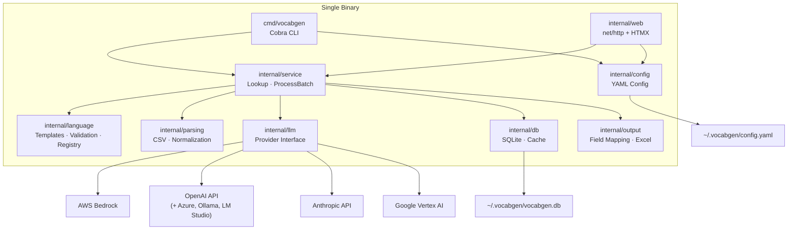
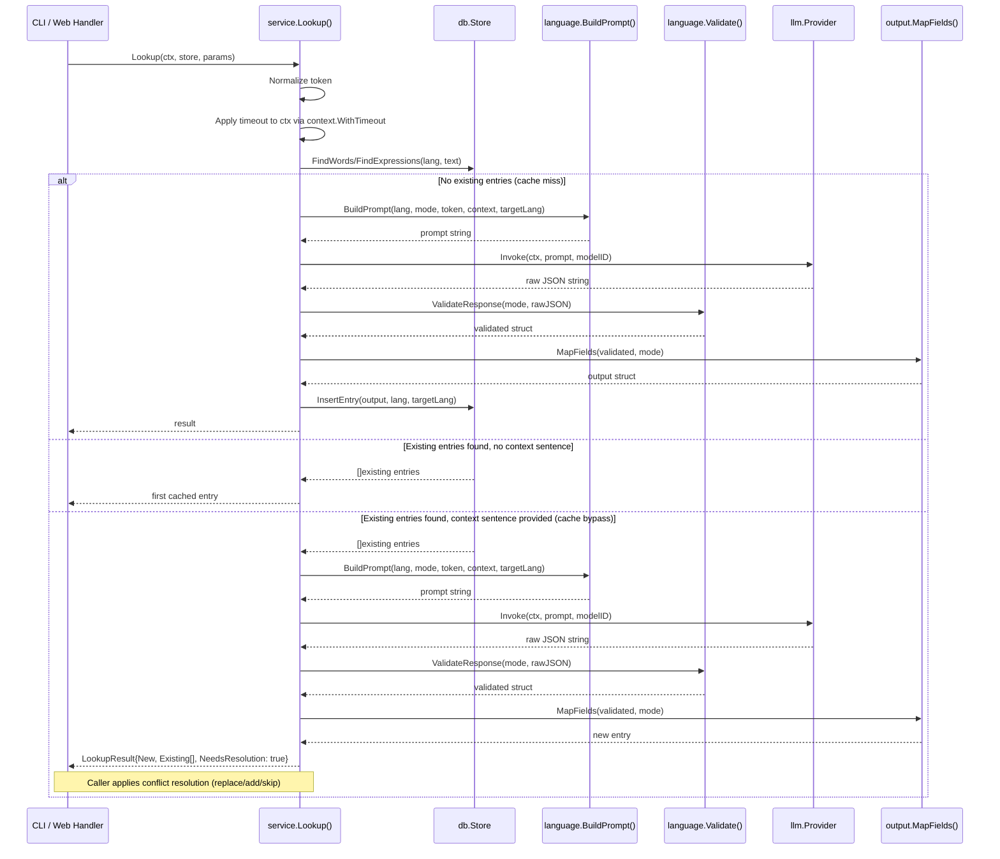
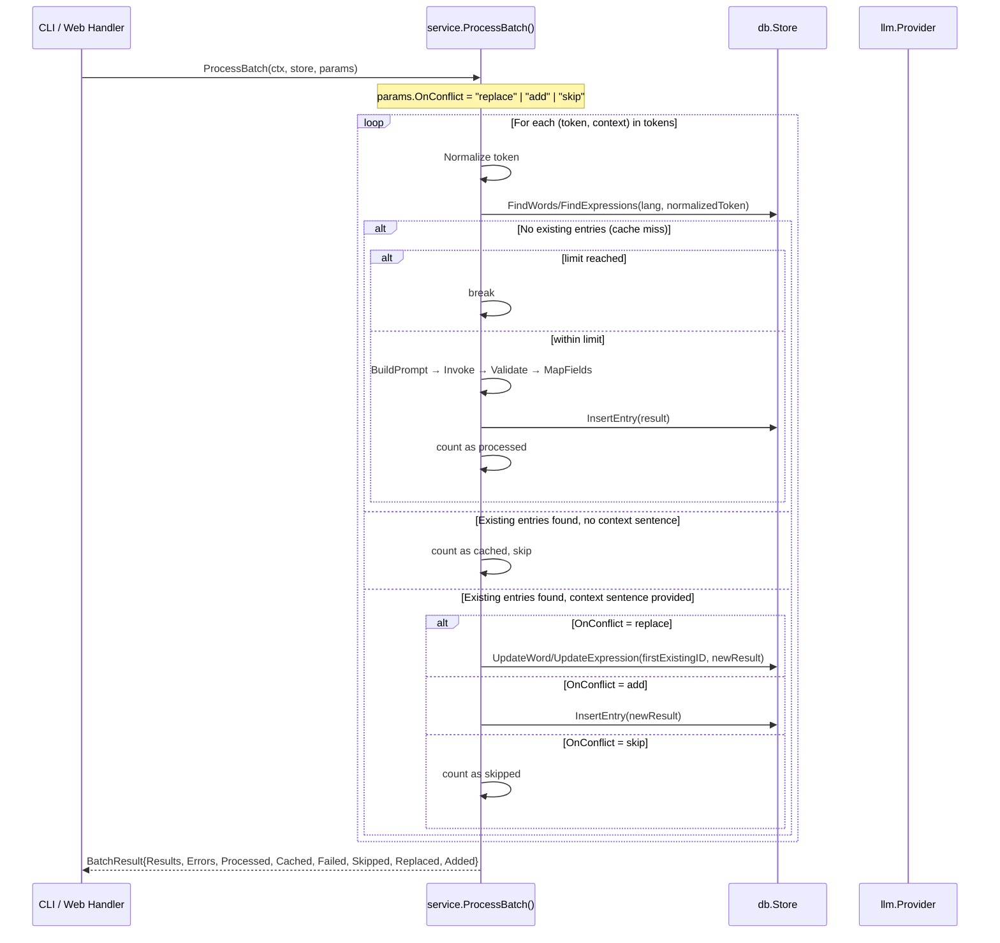

# Architecture

## System Architecture



## Package Layout

| Package | Path | Description |
|---------|------|-------------|
| main | `cmd/vocabgen/` | Cobra CLI entry point, subcommands, flag parsing |
| config | `internal/config/` | YAML config manager (`LoadConfig`, `SaveConfig`) |
| db | `internal/db/` | SQLite schema, migrations, CRUD, cache layer |
| language | `internal/language/` | Prompt templates, JSON validation, language registry |
| llm | `internal/llm/` | Provider interface, Bedrock/OpenAI/Anthropic/VertexAI |
| output | `internal/output/` | Field mapping, translation flattening, Excel export |
| parsing | `internal/parsing/` | CSV reading, word/expression normalization |
| service | `internal/service/` | `Lookup`, `ProcessBatch` — shared business logic |
| web | `internal/web/` | HTTP handlers, routes, embedded HTML templates |

## Provider Interface

```go
type Provider interface {
    Invoke(ctx context.Context, prompt string, modelID string) (string, error)
    Name() string
}
```

Providers are registered in a `map[string]NewProviderFunc` registry. Adding a provider requires one file and one registry entry. The service layer depends only on the interface.

| Provider | File | Auth |
|----------|------|------|
| Bedrock | `bedrock.go` | AWS credential chain |
| OpenAI | `openai.go` | API key (or none with custom base URL) |
| Anthropic | `anthropic.go` | API key |
| Vertex AI | `vertexai.go` | Google ADC |

## Data Flow: Single Lookup



## Data Flow: Batch Processing



## Key Design Decisions

| Decision | Choice | Rationale |
|----------|--------|-----------|
| CLI framework | Cobra | Subcommands, auto-generated help, flag parsing |
| Web framework | stdlib `net/http` + HTMX | No JS build step, embedded in binary |
| Database | SQLite via `modernc.org/sqlite` | Pure-Go, cross-compiles, zero-config |
| LLM abstraction | Go interface + registry | Testable with mocks, easy to extend |
| Config format | YAML | Human-readable, `gopkg.in/yaml.v3` |
| PBT library | `pgregory.net/rapid` | Go-native, integrates with `testing` |
| Excel export | `excelize/v2` | Pure-Go xlsx writer |
| Logging | `log/slog` | Stdlib, structured, leveled |
