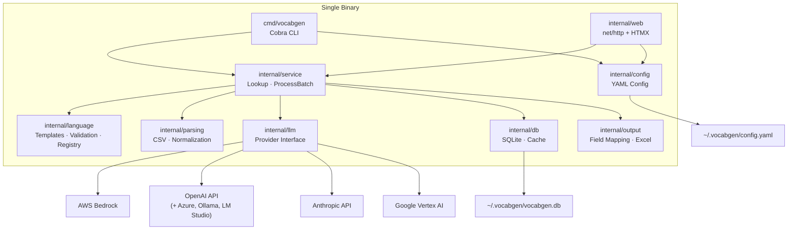
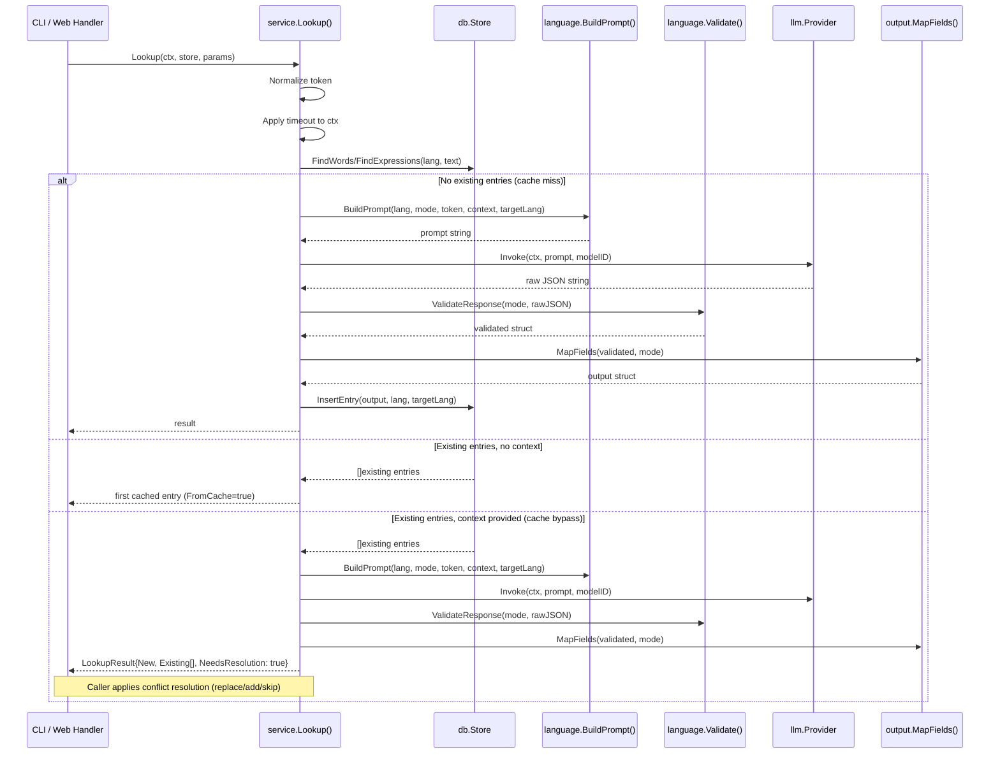
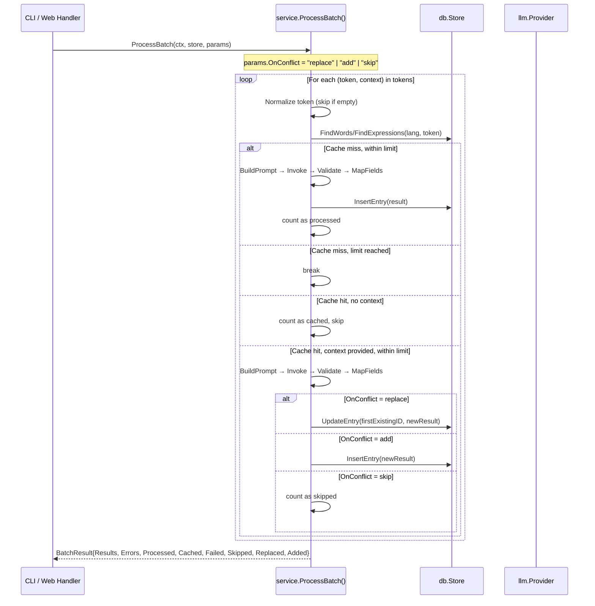
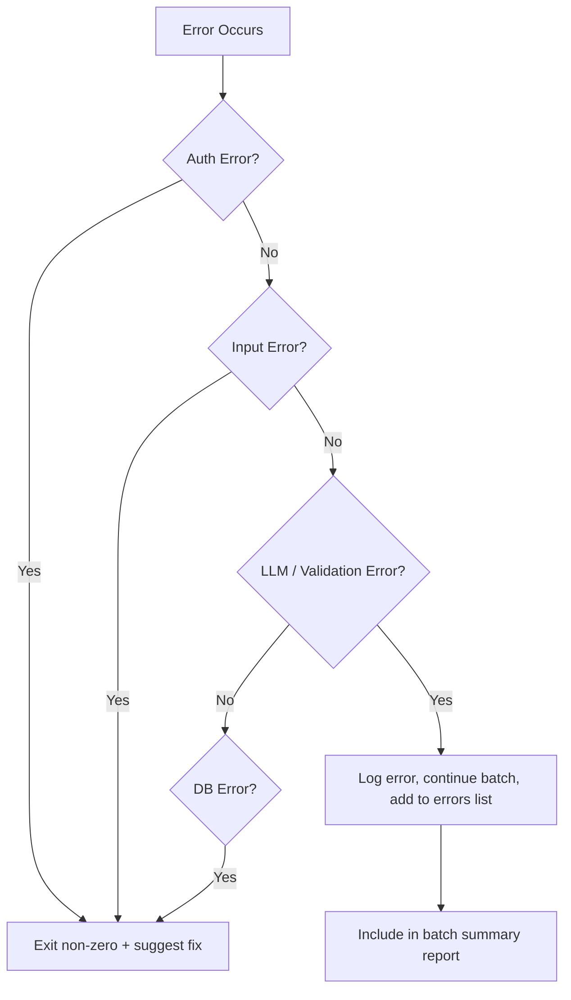

# Architecture

## Overview

vocabgen is a single-binary CLI and embedded web application that generates structured vocabulary lists for language learners. It processes words and expressions through LLM providers, validates JSON responses against English schemas, caches results in SQLite, and presents them via CLI output or a browser-based HTMX interface.

All templates, static assets, and the SQLite driver compile into one executable via `go:embed` and a pure-Go SQLite driver. Zero runtime dependencies.

## Design Principles

1. **Single Binary** — `go:embed` + pure-Go SQLite driver. No external files or runtime needed.
2. **Language-Agnostic** — Two unified prompt templates parameterized by `{source_language}`. No per-language code branches. The LLM provides native POS labels, register labels, and grammatical categories.
3. **Provider Abstraction** — A Go `Provider` interface decouples the service layer from any specific LLM API. New providers require one file and one registry entry.
4. **Cache-First with Context Bypass** — SQLite acts as a cache layer. Every lookup checks the DB before invoking the LLM. When a context sentence is provided for an existing entry, the cache is bypassed to get a context-specific result.
5. **Multi-Version Entries** — The database allows multiple entries per word/expression (e.g., "werk" as noun vs. verb). Conflict resolution (replace, add, skip) lets the user control how the vocabulary database evolves.
6. **Error Resilience** — Batch processing continues after per-item failures. Errors are collected and reported in a summary.
7. **Connotation-Aware** — A Core Rule Block and Decision Rubric in every prompt ensures translations preserve register and tone.

## System Architecture



## Package Layout

```
vocabgen/
├── cmd/vocabgen/          # Cobra CLI entry point
│   └── main.go
├── internal/
│   ├── config/            # YAML config manager (LoadConfig, SaveConfig)
│   ├── db/                # SQLite schema, migrations, CRUD, cache layer
│   ├── language/          # Prompt templates, schemas, validation, language registry
│   ├── llm/               # Provider interface, Bedrock/OpenAI/Anthropic implementations
│   ├── output/            # Field mapping, translation flattening, Excel export
│   ├── parsing/           # CSV reading, word/expression normalization
│   ├── service/           # Lookup, ProcessBatch — shared business logic
│   └── web/               # HTTP handlers, routes, embedded templates
│       └── templates/     # Go html/template files (go:embed)
├── go.mod
├── go.sum
└── Makefile
```

## Package Details

### `internal/llm` — Provider Interface

The provider interface decouples the service layer from any specific LLM API. Each provider is a separate file implementing two methods: `Invoke` (send prompt, get response) and `Name` (return provider identifier).

A `Registry` map connects provider name strings to constructor functions. Adding a new provider means writing one file and adding one entry to the registry.

| Provider | File | Auth Method | Retry |
|----------|------|-------------|-------|
| Bedrock | `bedrock.go` | AWS credential chain (profile or default) | Once on throttling/timeout |
| OpenAI | `openai.go` | API key (or none with custom base URL) | Once on HTTP 429 |
| Anthropic | `anthropic.go` | API key | Once on HTTP 429 |
| Vertex AI | `vertexai.go` | Google ADC (stub, not yet implemented) | Once on rate-limit |

All providers return `ProviderError` on failure, which wraps the provider name and underlying error. Callers use `errors.As(&ProviderError{})` for unified error handling regardless of which provider failed.

OpenAI provider supports custom base URLs for compatibility with Azure OpenAI, Ollama, LM Studio, vLLM, and any OpenAI-compatible server. When a custom base URL is set, no API key is required (local servers).

### `internal/language` — Templates, Validation, Registry

Three responsibilities in one package:

**Prompt Templates**: Two Go string constants (`WordsTemplate`, `ExpressionsTemplate`) parameterized by `{source_language}`, `{word}`/`{expression}`, `{context}`, and `{target_language_name}`. Both include a Core Rule Block (connotation/register/tone preservation) and Decision Rubric (prioritized translation criteria). `BuildPrompt` resolves language codes to full names via the registry and replaces all placeholders using `strings.NewReplacer`.

**JSON Validation**: `ValidateResponse` parses raw LLM JSON against English schemas. Required fields must be present; optional fields default to `""`. Translation fields (`english`, `target_translation`) are normalized from either plain strings or `{primary, alternatives}` objects into a consistent `Translation` struct. Returns `ValidationError` listing any missing or malformed fields.

**Language Registry**: A `map[string]string` mapping 11 language codes to full names (nl→Dutch, hu→Hungarian, etc.). `ResolveLanguageName` returns the full name for known codes or passes through unknown codes/names as-is. Used for both source and target language resolution.

### `internal/parsing` — CSV Reading and Normalization

`ReadInputFile` reads CSV files with UTF-8 encoding. No header detection — all non-empty lines are data. Single-column lines produce a token with empty context; two-column lines produce token + context sentence.

`NormalizeWord` strips quotes, collapses whitespace, preserves parenthetical inflection info. `NormalizeExpression` strips quotes and collapses whitespace. Both return empty string for whitespace-only input. Normalization is idempotent: `Normalize(Normalize(x)) == Normalize(x)`.

### `internal/service` — Business Logic

The service layer sits between the interface layers (CLI, web) and the infrastructure layers (database, LLM providers). Both CLI commands and HTTP handlers call the same functions.

**`Lookup`**: normalize token → check cache (FindWords/FindExpressions) → if no entries, invoke LLM and insert → if entries exist and no context, return cached → if entries exist and context provided, invoke LLM (cache bypass), return `LookupResult` with `NeedsResolution=true` so the caller can apply conflict resolution.

**`ProcessBatch`**: iterate tokens, normalize each, check cache, invoke LLM for misses, apply conflict strategy for context-based re-lookups, collect results and errors. Continues on per-item failures. Respects `--limit N` (cached items don't count toward limit). Supports dry-run mode (no LLM calls, no DB writes).

**`ResolveConflict`**: applies conflict resolution after a cache-bypass lookup. "replace" updates the existing entry by ID. "add" inserts alongside existing entries. "skip" is a no-op.

**Conflict Resolution Strategies**:

| Strategy | Behavior | Use Case |
|----------|----------|----------|
| `replace` | Update existing entry in-place by ID | Correct a previous translation |
| `add` | Insert new entry alongside existing ones | Multiple meanings (noun vs. verb) |
| `skip` | Discard new result, keep existing | Default for batch mode |

### `internal/db` — SQLite Storage

SQLite database at a configurable path (default `~/.vocabgen/vocabgen.db`). Pure-Go driver (`modernc.org/sqlite`) for cross-compilation.

**Schema**: `words` and `expressions` tables with no unique constraint on (source_language, word/expression) — multiple rows allowed for multi-version entries. Indexes on (source_language, word) and (source_language, expression) for query performance. `metadata` table tracks schema version for migrations.

**CRUD**: `FindWord`/`FindExpression` return first match or nil. `FindWords`/`FindExpressions` return all matches as a slice (for conflict-aware lookups). `InsertWord`/`InsertExpression` set timestamps. `UpdateWord`/`UpdateExpression` target by ID. All queries use parameterized `?` placeholders.

**Pagination**: `ListWords`/`ListExpressions` support filtering by source_language, target_language, search text (LIKE match), and pagination (default 50 per page).

**Import/Export**: `ImportWords`/`ImportExpressions` bulk-insert, skipping duplicates. `BackupTo` copies the DB file. `RestoreFrom` verifies the backup is valid SQLite, creates a safety backup, then replaces.

### `internal/output` — Field Mapping and Export

`MapFields` converts a `ValidatedEntry` to an output `Entry`, flattening translation objects to `"primary (alternatives)"` strings. Non-translation fields pass through as-is. Mode determines which fields are populated (words have collocations, secondary_meanings; expressions don't).

`ExportToExcel` writes entries to `.xlsx` using excelize. Column headers match database field names. Mode determines which columns to include.

### `internal/config` — YAML Configuration

Config file at `~/.vocabgen/config.yaml`. `LoadConfig` returns defaults if file missing. `SaveConfig` creates the directory if needed. API keys are deliberately excluded from the config file — they come from environment variables or `--api-key` CLI flag at runtime.

Default values: provider=bedrock, aws_region=us-east-1, default_source_language=nl, default_target_language=hu, db_path=~/.vocabgen/vocabgen.db.

### `internal/web` — HTTP Server and Web UI

Server-side rendering with Go `html/template` + HTMX + Tailwind CSS (CDN). All templates embedded via `go:embed`. No JavaScript build step.

**Pages**: Lookup (`/`), Batch (`/batch`), Config (`/config`), Database (`/database`).

**HTMX pattern**: Forms use `hx-post` to send requests; server returns HTML fragments that HTMX swaps into the page. No JSON parsing on the client side for UI interactions.

**Batch progress**: Server-Sent Events (SSE) stream real-time progress via `http.Flusher`. Client uses HTMX SSE extension.

**Conflict resolution UI**: When a lookup with context finds existing entries, the server returns a `lookup_conflict.html` partial showing existing entries side-by-side with the new result, plus resolve buttons (replace/add/skip).

### `cmd/vocabgen` — CLI Entry Point

Cobra CLI with subcommands: `lookup`, `batch`, `serve`, `backup`, `restore`, `version`.

`PersistentPreRunE` on the root command loads config, applies CLI flag overrides, and configures `slog`. Provider is created from config + flags via the registry. SQLite store is opened from the configured path.

Version injected at build time via `-ldflags -X main.version=... -X main.buildDate=...`.

## Data Flow: Single Lookup



## Data Flow: Batch Processing



## Data Models

### Words JSON Schema (LLM Response)

| Field | Type | Required | Description |
|-------|------|----------|-------------|
| `word` | string | yes | Canonical form (infinitive/singular) |
| `type` | string | yes | Native POS label (e.g., "znw", "főnév") |
| `article` | string | yes | Article/gender marker, or "—" |
| `definition` | string | yes | Definition in source language |
| `english_definition` | string | no | English explanation of meaning |
| `example` | string | yes | Example sentence in source language |
| `english` | string or object | yes | `{primary, alternatives}` or plain string |
| `target_translation` | string or object | yes | `{primary, alternatives}` or plain string |
| `notes` | string | no | Connotation notes, register, tone |
| `connotation` | string | no | Emotional/evaluative association |
| `register` | string | no | Native register label |
| `collocations` | string | no | 2–4 common collocations, semicolon-separated |
| `contrastive_notes` | string | no | Near-synonyms with difference explanation |
| `secondary_meanings` | string | no | Additional meanings, semicolon-separated |

### Expressions JSON Schema (LLM Response)

| Field | Type | Required | Description |
|-------|------|----------|-------------|
| `expression` | string | yes | The expression text |
| `definition` | string | yes | Definition in source language |
| `english_definition` | string | no | English explanation of meaning |
| `example` | string | yes | Example sentence in source language |
| `english` | string or object | yes | `{primary, alternatives}` or plain string |
| `target_translation` | string or object | yes | `{primary, alternatives}` or plain string |
| `notes` | string | no | Connotation notes, register, tone |
| `connotation` | string | no | Emotional/evaluative association |
| `register` | string | no | Native register label |
| `contrastive_notes` | string | no | Near-synonyms with difference explanation |

### Translation Object

Nested form: `{"primary": "main translation", "alternatives": "alt1; alt2"}`
Plain string form: validator normalizes to `{"primary": "the string", "alternatives": ""}`

### SQLite Schema

Words and expressions tables with no unique constraint on (source_language, word/expression) — multiple rows allowed for multi-version entries. Indexes for query performance, not uniqueness.

Tables: `metadata` (schema versioning), `words` (20 columns), `expressions` (16 columns). Timestamps in RFC3339 format.

## Error Handling



| Category | Examples | Behavior |
|----------|----------|----------|
| Authentication | Missing API key, expired AWS creds | Fail fast, exit non-zero, suggest fix |
| Input | File not found, empty file, invalid mode | Fail fast, exit non-zero |
| LLM invocation | Throttling, timeout, empty response | Log, retry once (1s delay), continue batch on failure |
| Validation | Invalid JSON, missing required fields | Log, continue batch, add to errors |
| Database | SQLite open failure, migration error | Fail fast, exit non-zero |

API error responses use `{"detail": "human-readable message"}` with status codes 400, 413, 500, 502.

## Web UI Architecture

Server-side rendering with Go `html/template` + HTMX + Tailwind CSS (CDN). All templates embedded in the binary.

### Template Structure

```
internal/web/templates/
├── base.html              # Shared layout: nav, head, Tailwind/HTMX CDN
├── lookup.html            # Lookup page
├── batch.html             # Batch upload page
├── config.html            # Settings page
├── database.html          # Browse/edit/import/export page
└── partials/
    ├── lookup_result.html     # Vocabulary entry display
    ├── lookup_conflict.html   # Side-by-side existing vs new with resolve buttons
    ├── batch_summary.html     # Processed/cached/failed/replaced/added counts
    ├── config_form.html       # Config form with conditional provider fields
    ├── entry_edit.html        # Edit form for a single entry
    └── entry_table.html       # Paginated table rows
```

### HTMX Interaction Pattern

Forms use `hx-post`/`hx-put`/`hx-delete` to send requests. Server returns HTML fragments. HTMX swaps them into the page via `hx-target` and `hx-swap`. No client-side JSON parsing for UI interactions.

| User Action | Endpoint | Response |
|-------------|----------|----------|
| Submit lookup | POST /api/lookup/html | `lookup_result.html` or `lookup_conflict.html` |
| Resolve conflict | POST /api/lookup/resolve/html | `lookup_result.html` |
| Upload batch CSV | POST /api/batch/html | Starts SSE stream |
| Batch progress | GET /api/batch/stream | SSE events (progress, complete) |
| Save config | PUT /api/config | `config_form.html` with success message |
| Search database | GET /api/words?search=... | `entry_table.html` |
| Edit entry | PUT /api/words/{id} | Updated row HTML |
| Delete entry | DELETE /api/words/{id} | Empty (row removed) |
| Import CSV | POST /api/import | Import summary |
| Export Excel | GET /api/export | .xlsx file download |

### API Routes

| Method | Path | Description |
|--------|------|-------------|
| POST | /api/lookup | Single lookup (JSON) |
| POST | /api/lookup/html | Single lookup (HTMX partial) |
| POST | /api/lookup/resolve | Resolve conflict (JSON) |
| POST | /api/lookup/resolve/html | Resolve conflict (HTMX partial) |
| POST | /api/batch | Batch processing (multipart) |
| POST | /api/batch/html | Batch upload (HTMX) |
| GET | /api/batch/stream | SSE progress stream |
| GET | /api/config | Read config |
| PUT | /api/config | Update config |
| GET | /api/config/html | Config form partial |
| POST | /api/test-connection | Test provider connection |
| GET | /api/words | List/search words (paginated) |
| GET | /api/expressions | List/search expressions (paginated) |
| PUT | /api/words/{id} | Update word entry |
| PUT | /api/expressions/{id} | Update expression entry |
| DELETE | /api/words/{id} | Delete word entry |
| DELETE | /api/expressions/{id} | Delete expression entry |
| POST | /api/import | CSV import (multipart) |
| GET | /api/export | Excel export |
| GET | /api/health | Health check |
| GET | /api/languages | Supported languages list |

## Testing Strategy

Dual approach: property-based tests (rapid) for universal invariants + table-driven tests for specific edge cases.

19 correctness properties validated via `pgregory.net/rapid` (100+ iterations each). Integration tests with mocked LLM providers and real SQLite. Web API tests via `httptest`.

See the design document for the full list of correctness properties (P1–P19).

## Key Design Decisions

| Decision | Choice | Rationale |
|----------|--------|-----------|
| CLI framework | Cobra | Subcommands, auto-generated help, flag parsing |
| Web framework | stdlib `net/http` + HTMX | No JS build step, embedded in binary |
| Database | SQLite via `modernc.org/sqlite` | Pure-Go, cross-compiles, zero-config |
| LLM abstraction | Go interface + registry | Testable with mocks, easy to extend |
| Config format | YAML | Human-readable, `gopkg.in/yaml.v3` |
| PBT library | `pgregory.net/rapid` | Go-native, integrates with `testing` |
| Excel export | `excelize/v2` | Pure-Go xlsx writer |
| Logging | `log/slog` | Stdlib, structured, leveled |
| Templates | `go:embed` + `html/template` | Compiled into binary, auto-escaping |
| Prompt formatting | `strings.NewReplacer` | Named placeholders, single-pass, order-independent |
